# 포장실 프로그램 사용 설명서

대상 프로그램: `Label_Match`

대상 사용자: 포장실 현장 작업자, 비전문가 사용자

작성 기준일: 2026-06-27

이 문서는 포장실 작업자가 실제 화면을 보면서 그대로 따라 할 수 있도록 만든 사용 설명서입니다. 어려운 말보다 화면에서 무엇을 보고 무엇을 해야 하는지 중심으로 설명합니다.

## 전체 워크플로우

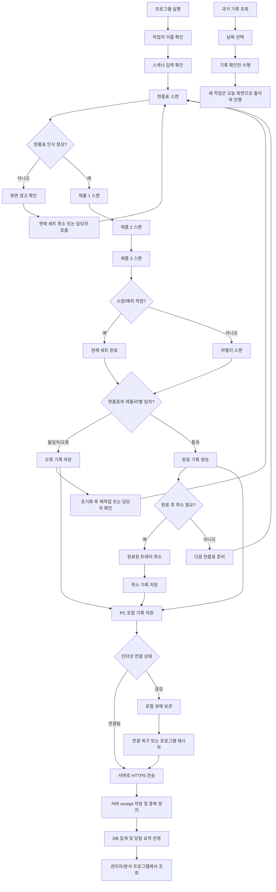
```mermaid
flowchart TD
    A["프로그램 실행"] --> B["작업자 이름 확인"]
    B --> C["스캐너 입력 확인"]
    C --> D["현품표 스캔"]
    D --> E{"현품표 인식 정상?"}
    E -- "아니오" --> E1["화면 경고 확인"]
    E1 --> E2["현재 세트 취소 또는 담당자 호출"]
    E2 --> D
    E -- "예" --> F["제품 1 스캔"]
    F --> G["제품 2 스캔"]
    G --> H["제품 3 스캔"]
    H --> I{"소량/예외 작업?"}
    I -- "예" --> J["현재 세트 완료"]
    I -- "아니오" --> K["라벨지 스캔"]
    J --> L{"현품표와 제품/라벨 일치?"}
    K --> L
    L -- "불일치/오류" --> M["오류 기록 저장"]
    M --> N["초기화 후 재작업 또는 담당자 확인"]
    N --> D
    L -- "통과" --> O["완료 기록 생성"]
    O --> P{"완료 후 취소 필요?"}
    P -- "예" --> Q["완료된 트레이 취소"]
    P -- "아니오" --> R["다음 현품표 준비"]
    Q --> S["취소 기록 저장"]
    R --> D

    M --> T["PC 로컬 기록 저장"]
    O --> T
    S --> T
    T --> U{"인터넷 연결 상태"}
    U -- "연결됨" --> V["서버로 HTTPS 전송"]
    U -- "끊김" --> W["로컬 큐에 보관"]
    W --> X["연결 복구 또는 프로그램 재시작"]
    X --> V
    V --> Y["서버 receipt 저장 및 중복 방지"]
    Y --> Z["DB 집계 및 당일 요약 반영"]
    Z --> AA["관리자/분석 프로그램에서 조회"]

    AB["과거 기록 조회"] --> AC["날짜 선택"]
    AC --> AD["기록 확인만 수행"]
    AD --> AE["새 작업은 오늘 화면으로 돌아와 진행"]
```

## 1. 꼭 기억할 것

포장실 프로그램은 현품표와 제품/라벨 바코드가 서로 맞는지 확인하고, 작업 기록을 남기는 프로그램입니다.

기본 작업 순서는 항상 같습니다.

1. 프로그램을 실행합니다.
2. 작업자 이름이 맞는지 확인합니다.
3. 현품표를 먼저 스캔합니다.
4. 제품 1, 제품 2, 제품 3을 순서대로 스캔합니다.
5. 마지막으로 라벨지를 스캔합니다.
6. 화면에 `통과 완료 - 다음 현품표 스캔`이 나오면 다음 작업을 시작합니다.

중요한 원칙:

- 화면 맨 위 큰 글자를 보고 다음에 무엇을 스캔할지 확인합니다.
- 화면이 `1/5 현품표 스캔`일 때만 새 트레이 작업을 시작합니다.
- 제품을 잘못 스캔했거나 섞인 것 같으면 임의로 계속하지 말고 화면 경고를 확인합니다.
- 완료된 기록을 취소할 때는 `완료된 트레이 취소` 버튼을 사용합니다.
- 진행 중인 작업을 버리고 새로 시작할 때는 `현재 세트 취소` 버튼을 사용합니다.
- 소량 작업처럼 5번을 모두 스캔하지 않는 경우에만 `현재 세트 완료` 버튼을 사용합니다.

스캔 기록은 먼저 이 PC 안에 저장됩니다. 그래서 인터넷이 잠시 끊겨도 스캔 작업은 계속할 수 있습니다. 인터넷이 다시 연결된 뒤의 수량 확인은 담당자가 확인합니다.

단, 인터넷이 끊긴 동안에는 최신 작업량이 다른 화면에 바로 보이지 않을 수 있습니다. PC가 꺼져 있거나 저장공간이 부족한 경우에는 담당자 확인이 필요합니다.

작업자가 직접 수정하면 안 되는 것:

- 프로그램 폴더나 작업 파일
- 담당자가 요청하지 않은 프로그램 관련 파일
- 작업 기록 파일

문제가 있으면 프로그램 화면을 캡처해서 담당자에게 전달해야 합니다. 파일을 직접 고치거나 삭제하면 회사 기록이 틀어질 수 있습니다.

## 2. 주요 화면 한눈에 보기

아래 이미지는 이 설명서에서 다루는 주요 화면을 한 번에 모아 본 것입니다.

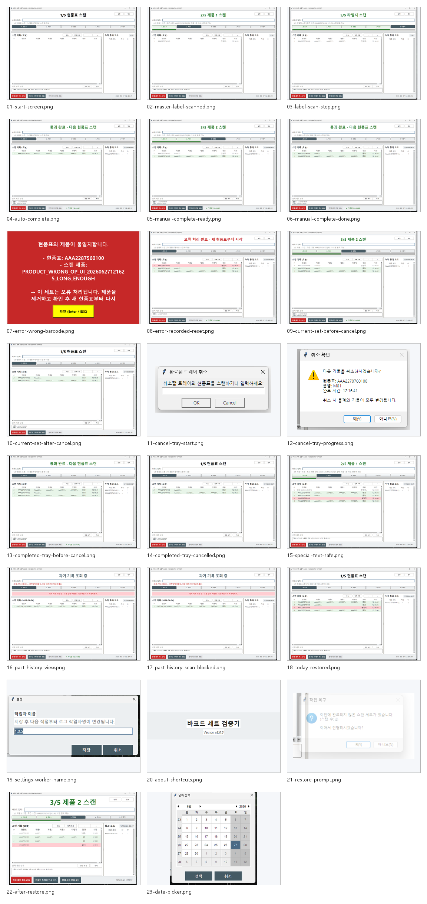

처음에는 화면이 복잡해 보여도 실제로 작업자가 자주 보는 곳은 몇 군데뿐입니다.

- 맨 위 큰 글자: 지금 무엇을 스캔해야 하는지 표시합니다.
- 바코드 입력칸: 스캐너 입력이 들어가는 곳입니다.
- 단계 표시줄: 현품표, 제품1, 제품2, 제품3, 라벨지 중 어디까지 왔는지 표시합니다.
- 왼쪽 스캔 기록: 오늘 처리한 기록과 오류 기록을 보여줍니다.
- 오른쪽 누적 통과 코드: 오늘 통과한 코드별 수량을 보여줍니다.
- 하단 버튼: 현재 세트 취소, 완료된 트레이 취소, 현재 세트 완료를 실행합니다.

## 3. 프로그램 실행 전 확인

작업 시작 전 다음을 확인합니다.

1. 바코드 스캐너가 PC에 연결되어 있는지 확인합니다.
2. 메모장을 열고 아무 바코드를 스캔해 글자가 입력되는지 확인합니다.
3. 프로그램을 실행합니다.
4. 화면 우측 상단 `설정`에서 작업자 이름이 맞는지 확인합니다.
5. 화면 맨 위가 `1/5 현품표 스캔`인지 확인합니다.

스캐너가 안 찍힐 때:

1. USB 선이 빠져 있는지 확인합니다.
2. 메모장에 스캔해 봅니다.
3. 메모장에도 안 찍히면 스캐너 또는 USB 연결 문제입니다.
4. 메모장에는 찍히는데 프로그램에 안 들어가면 프로그램 창을 한 번 클릭한 뒤 다시 스캔합니다.

## 4. 시작 화면

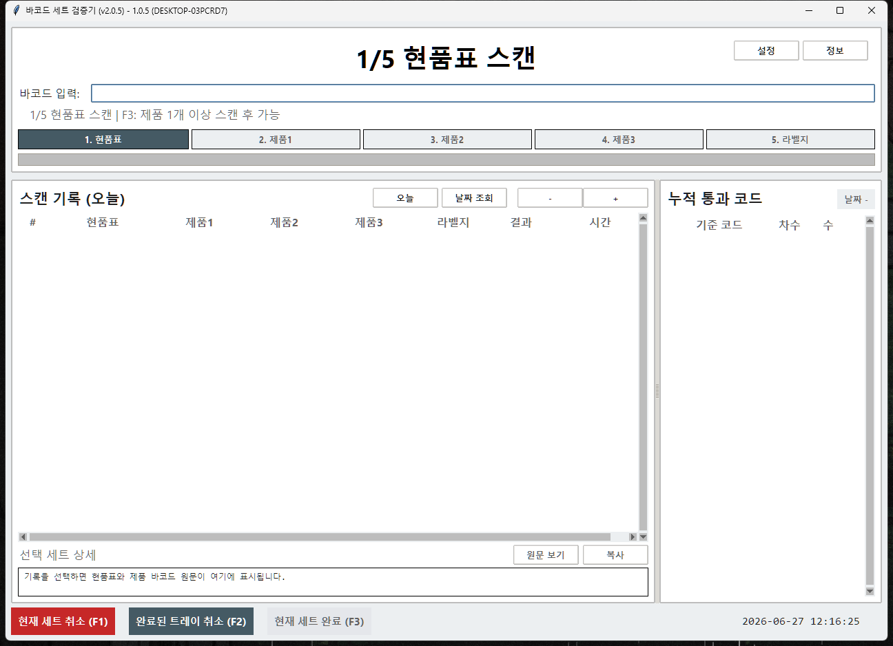

프로그램을 열면 위와 같은 기본 화면이 보입니다.

시작 화면에서 볼 것:

- 맨 위 큰 글자가 `1/5 현품표 스캔`인지 확인합니다.
- `바코드 입력` 칸이 보이면 스캐너 입력을 받을 준비가 된 상태입니다.
- 왼쪽 `스캔 기록 (오늘)`에는 오늘 작업한 내역이 표시됩니다.
- 오른쪽 `누적 통과 코드`에는 오늘 통과 완료된 품목별 수량이 표시됩니다.
- 하단에는 `현재 세트 취소`, `완료된 트레이 취소`, `현재 세트 완료` 버튼이 있습니다.

새 작업은 항상 이 상태에서 시작합니다.

주의:

- 다른 작업자가 쓰던 PC라면 작업자 이름을 먼저 확인합니다.
- 과거 기록 조회 중인 화면에서는 스캔을 시작하지 않습니다.
- 오류가 남아 있으면 확인 버튼을 눌러 오류 화면을 닫고, `1/5 현품표 스캔` 상태인지 확인합니다.

## 5. 작업자 이름 확인과 변경

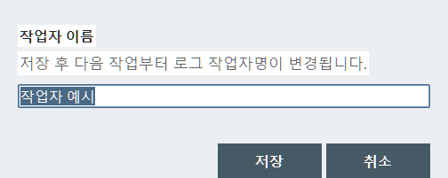

작업자 이름은 작업 기록에 그대로 남습니다. 다른 사람 이름으로 작업하면 나중에 작업량과 추적 기록이 틀어집니다.

작업자 이름 확인 방법:

1. 화면 우측 상단 `설정` 버튼을 누릅니다.
2. `작업자 이름` 칸에 표시된 이름을 확인합니다.
3. 이름이 맞으면 `취소` 또는 `ESC`로 닫습니다.
4. 이름이 틀리면 올바른 이름을 입력하고 `저장`을 누릅니다.

주의:

- 작업 중인 세트가 있으면 설정 변경을 하지 않습니다.
- 이름을 바꿨다면 다음 작업부터 새 이름으로 기록됩니다.
- 작업자 이름을 비워 두면 저장할 수 없습니다.
- 이름 앞에 `=`, `+`, `-`, `@` 같은 특수문자는 넣지 않습니다.

## 6. 현품표 스캔

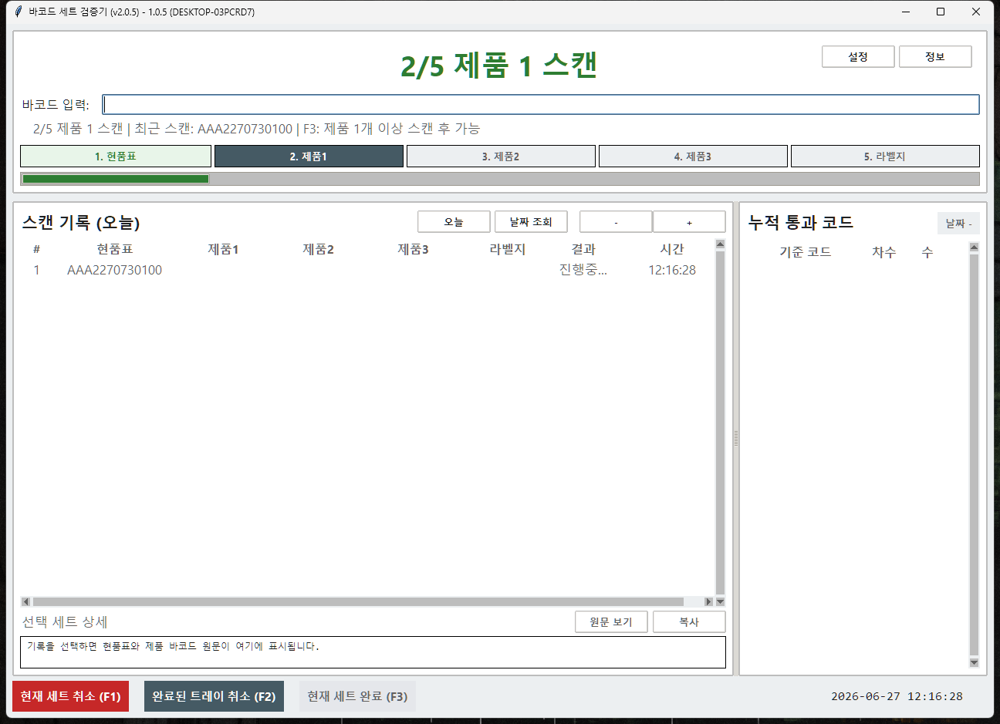

현품표는 작업의 시작 기준입니다. 제품 바코드보다 먼저 현품표를 스캔해야 합니다.

정상일 때 화면 변화:

- 맨 위 큰 글자가 `2/5 제품 1 스캔`으로 바뀝니다.
- 단계 표시줄에서 `1. 현품표`가 완료된 것처럼 표시됩니다.
- 왼쪽 스캔 기록에 새 줄이 생기거나 현재 작업 상태가 반영됩니다.
- 아래 안내줄에 최근 스캔한 값이 표시됩니다.

작업자가 할 일:

1. 현품표를 스캔합니다.
2. 화면이 제품 1 단계로 넘어갔는지 봅니다.
3. 넘어가지 않거나 빨간 오류가 나오면 오류 내용을 확인합니다.
4. 정상이라면 제품 1을 스캔합니다.

현품표에서 오류가 나는 경우:

- 현품표가 아닌 제품 바코드를 먼저 스캔한 경우
- 등록되지 않은 현품표인 경우
- 이미 완료한 현품표를 다시 스캔한 경우
- 바코드가 잘렸거나 스캐너가 일부만 입력한 경우

이때는 임의로 계속하지 말고, 오류 화면을 확인한 뒤 담당자 지시에 따릅니다.

## 7. 제품 1, 제품 2, 제품 3 스캔

현품표 다음에는 제품 바코드를 순서대로 스캔합니다.

화면 순서:

1. `2/5 제품 1 스캔`
2. `3/5 제품 2 스캔`
3. `4/5 제품 3 스캔`

제품 2와 제품 3도 같은 방식으로 진행됩니다. 맨 위 큰 글자와 단계 표시줄만 다음 단계로 바뀝니다.

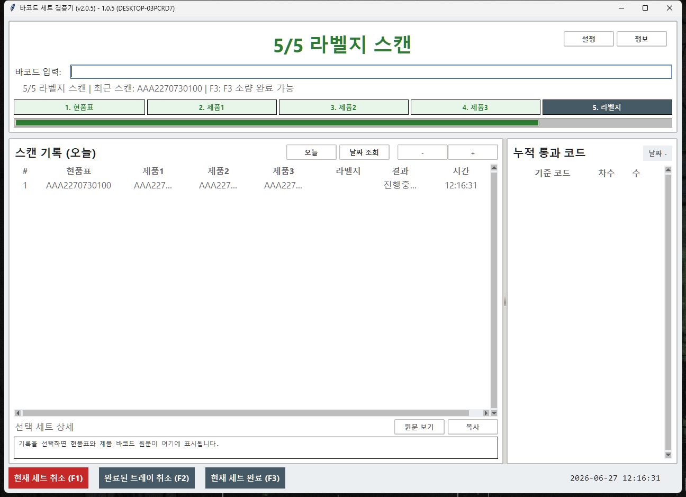

작업자가 볼 것:

- 맨 위 큰 글자가 다음 단계로 바뀌는지 확인합니다.
- 단계 표시줄의 녹색 진행 상태를 확인합니다.
- 왼쪽 기록에서 방금 스캔한 값이 들어갔는지 확인합니다.
- 제품이 현품표와 맞지 않으면 빨간 오류가 나옵니다.

주의:

- 같은 제품을 두 번 스캔하지 않습니다.
- 다른 트레이 제품을 섞어서 스캔하지 않습니다.
- 오류가 나왔는데 계속 다른 제품을 찍지 않습니다.
- 프로그램이 오류 처리 후 새 현품표 단계로 돌아가면, 해당 제품을 교체하고 처음부터 다시 검증합니다.

## 8. 마지막 라벨지 스캔

제품 3개까지 정상 스캔하면 화면이 `5/5 라벨지 스캔`으로 바뀝니다.

작업자가 할 일:

1. 마지막 라벨지를 스캔합니다.
2. 화면이 `통과 완료 - 다음 현품표 스캔`으로 바뀌는지 확인합니다.
3. 기록이 저장되는지 확인합니다.
4. 다음 트레이의 현품표를 스캔합니다.

라벨지 단계에서 오류가 나는 경우:

- 라벨지가 아닌 제품 바코드를 스캔한 경우
- 생산일자 정보가 없거나 형식이 맞지 않는 경우
- 현품표/제품과 맞지 않는 라벨지를 스캔한 경우
- 스캐너 입력이 끊긴 경우

오류가 나면 해당 트레이를 임의로 통과 처리하지 말고, 오류 내용을 확인합니다.

## 9. 자동 완료

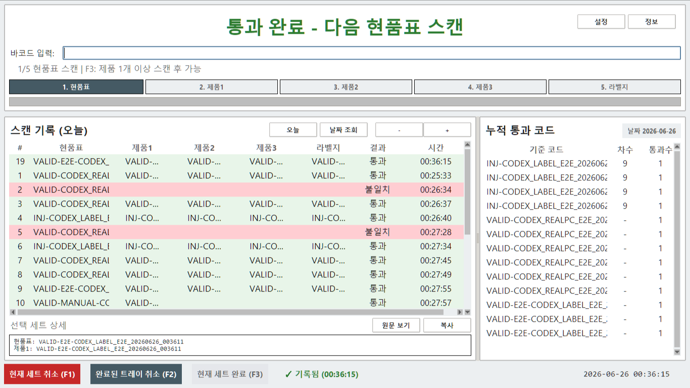

5번째 스캔까지 모두 정상이라면 프로그램이 자동으로 작업을 완료합니다.

정상 완료 화면:

- 맨 위에 `통과 완료 - 다음 현품표 스캔`이 보입니다.
- 왼쪽 `스캔 기록 (오늘)`에 `통과` 기록이 추가됩니다.
- 오른쪽 `누적 통과 코드` 수량이 올라갑니다.
- 하단 저장 상태에 기록됨 표시가 나올 수 있습니다.
- 화면은 다시 새 현품표를 받을 준비가 됩니다.

이 화면이 나오면:

1. 해당 트레이 작업은 정상 완료된 것입니다.
2. 다음 트레이의 현품표를 바로 스캔하면 됩니다.
3. 완료된 기록을 잘못 처리했다면 `완료된 트레이 취소` 버튼을 사용합니다.

## 10. 소량 작업: 현재 세트 완료

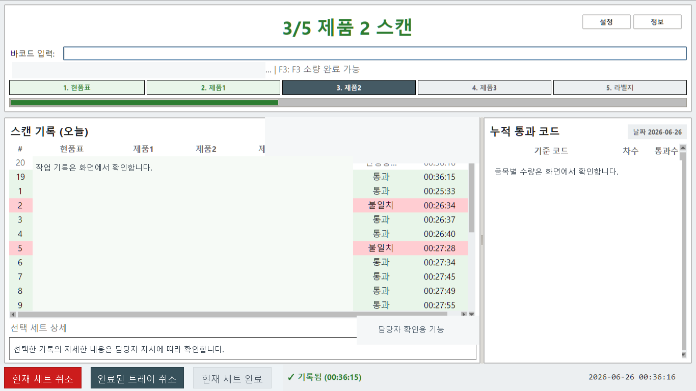

일반 작업은 현품표, 제품 1, 제품 2, 제품 3, 라벨지까지 총 5번 스캔해야 합니다.

다만 샘플, 소량, 특수 작업처럼 일부만 스캔하고 완료해야 하는 경우가 있을 수 있습니다. 이때만 `현재 세트 완료` 버튼을 사용합니다.

사용 가능한 조건:

- 현품표를 스캔했습니다.
- 제품을 1개 이상 스캔했습니다.
- 아직 5개를 모두 완료하지 않았습니다.
- 현재 세트에 오류가 없습니다.

사용 방법:

1. 필요한 만큼 제품을 스캔합니다.
2. 하단 `현재 세트 완료` 버튼이 활성화되었는지 확인합니다.
3. 화면의 버튼을 누릅니다.
4. 확인창이 나오면 내용을 확인합니다.
5. 맞으면 완료합니다.

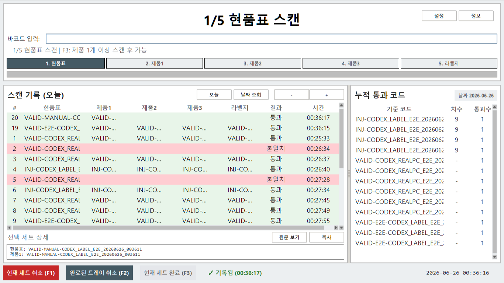

수동 완료 후:

- 기록에는 통과 기록이 남습니다.
- 일반 5개 완료와 구분되는 부분 완료 정보가 함께 남습니다.
- 다음 작업은 다시 현품표부터 시작합니다.

주의:

- 일반 작업을 빨리 끝내기 위해 이 버튼을 쓰면 안 됩니다.
- 실수로 제품을 덜 스캔한 상태에서 이 버튼을 누르지 않습니다.
- 사용 기준이 애매하면 작업 리더에게 확인합니다.

## 11. 진행 중인 작업 취소: 현재 세트 취소

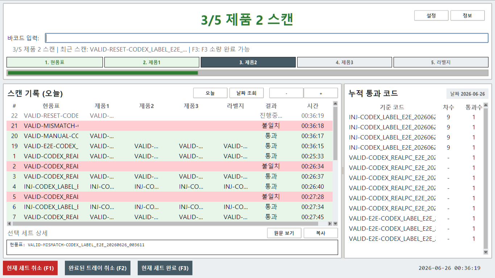

`현재 세트 취소`는 아직 완료되지 않은 현재 작업을 버리고 처음부터 다시 시작할 때 사용합니다.

사용하는 상황:

- 현품표를 잘못 스캔했습니다.
- 제품을 잘못 잡았다는 것을 바로 알았습니다.
- 스캔 중 트레이가 섞였습니다.
- 작업자 지시에 따라 현재 작업을 다시 시작해야 합니다.

사용 방법:

1. 하단 `현재 세트 취소` 버튼을 누릅니다.
2. 확인창이 나오면 내용을 확인합니다.
3. 화면이 `1/5 현품표 스캔`으로 돌아왔는지 확인합니다.
4. 올바른 현품표부터 다시 스캔합니다.

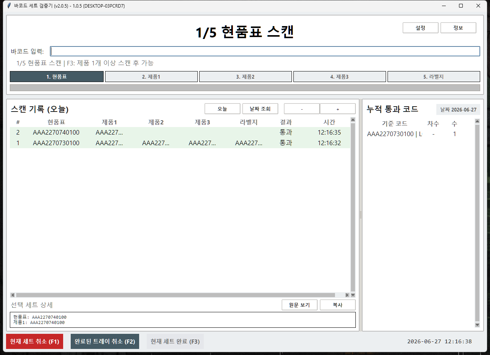

주의:

- 이미 `통과` 완료된 기록은 이 버튼으로 취소하지 못합니다.
- 완료된 기록을 취소하려면 `완료된 트레이 취소` 버튼을 사용합니다.
- 이 버튼은 현재 진행 중인 세트를 버리는 기능입니다.

## 12. 완료된 트레이 취소

완료된 트레이를 나중에 취소해야 하는 경우가 있습니다.

예시:

- 통과 처리 후 현품표가 잘못된 것을 알았습니다.
- 제품이 섞였는데 완료 처리했습니다.
- 작업 리더가 특정 완료 기록을 취소하라고 지시했습니다.

이때는 `완료된 트레이 취소` 버튼을 사용합니다.

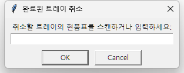

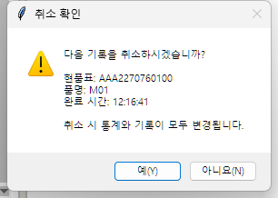

취소 전에는 취소할 대상이 `통과` 기록으로 남아 있습니다.

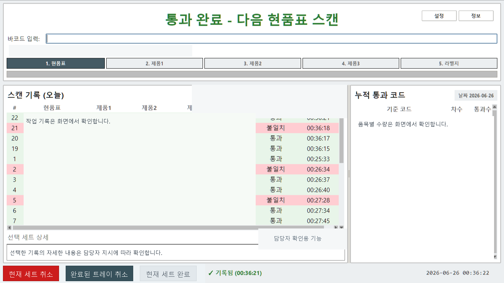

사용 방법:

1. 하단 `완료된 트레이 취소` 버튼을 누릅니다.
2. 취소할 현품표를 확인합니다.
3. 취소할 트레이의 현품표를 스캔하거나 입력합니다.
4. 확인창이 나오면 취소 대상이 맞는지 봅니다.
5. 맞으면 취소합니다.

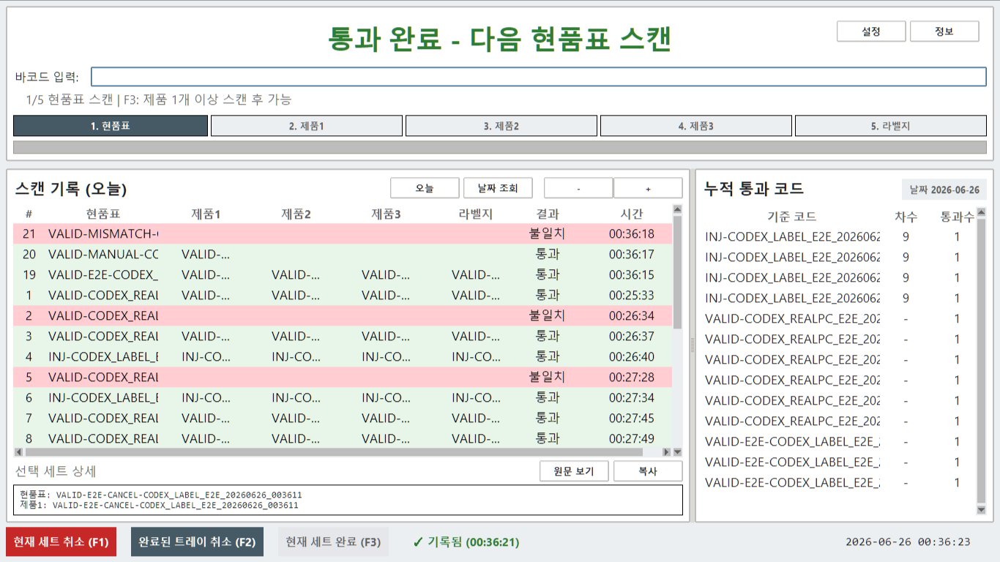

취소 후:

- 해당 완료 기록이 취소 처리됩니다.
- 누적 수량이 다시 계산됩니다.
- 취소 기록도 작업 기록에 남습니다.

주의:

- 아무 기록이나 취소하면 안 됩니다.
- 취소할 현품표가 확실하지 않으면 담당자에게 확인합니다.
- 과거 날짜 조회 중에는 완료된 트레이 취소를 할 수 없습니다. `오늘` 버튼으로 돌아온 뒤 처리합니다.

## 13. 오류와 불일치가 나왔을 때

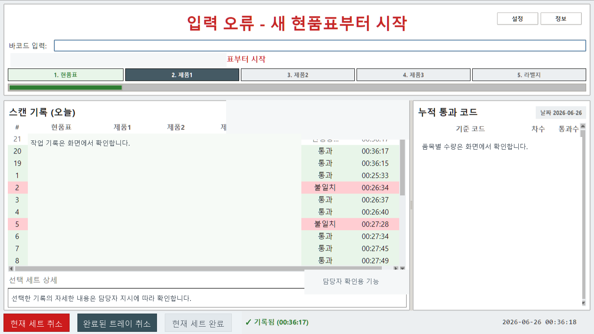

오류가 나오면 프로그램 창 위에 빨간 경고창이 크게 뜹니다.

작업자가 할 일:

1. 스캔을 멈춥니다.
2. 화면의 빨간 안내 문구를 읽습니다.
3. 경고음이 나오면 `확인 (Enter / ESC)` 버튼으로 닫습니다.
4. 문제 제품을 작업 리더에게 보여줍니다.
5. 화면이 새 현품표 단계로 돌아갔는지 확인합니다.
6. 올바른 제품으로 교체한 뒤 현품표부터 다시 시작합니다.

자주 나오는 오류:

- 현품표가 아닌 바코드를 먼저 스캔했습니다.
- 제품이 현품표와 맞지 않습니다.
- 같은 제품을 같은 세트 안에서 다시 스캔했습니다.
- 이미 다른 세트에서 처리한 제품입니다.
- 마지막 라벨지가 맞지 않습니다.
- 바코드 형식이 맞지 않거나 너무 짧게 입력됐습니다.

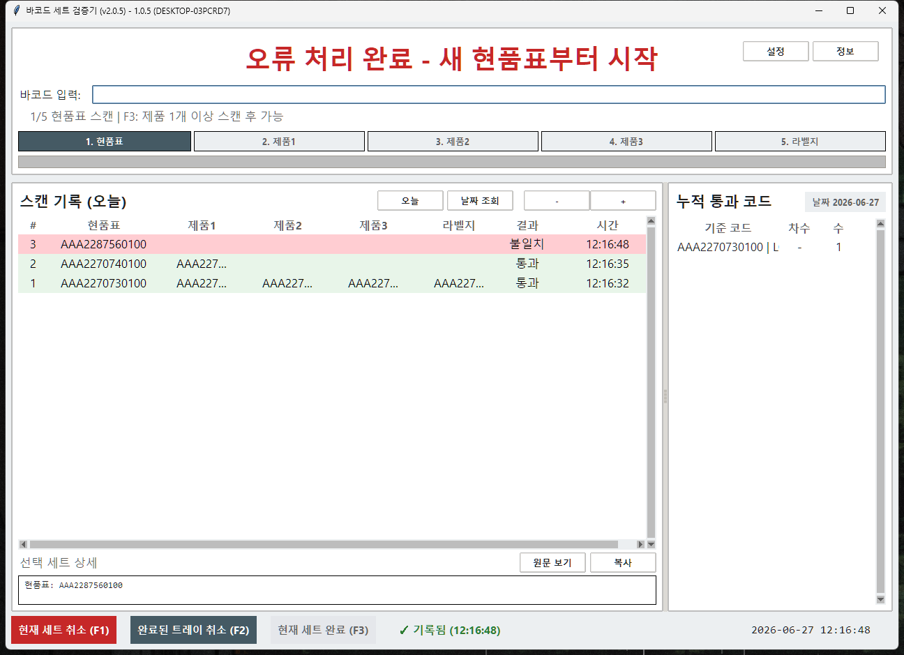

오류 처리 후에는:

- 오류 기록이 왼쪽 스캔 기록에 남습니다.
- 현재 세트는 새 현품표부터 다시 시작하는 상태가 됩니다.
- 문제 제품은 교체하거나 작업 리더에게 전달합니다.

주의:

- 오류가 난 제품을 그대로 다시 통과시키지 않습니다.
- 바코드를 손으로 고쳐 입력하지 않습니다.
- 오류 기록을 직접 삭제하지 않습니다.
- 같은 문제가 반복되면 스캐너, 라벨 출력, 현품표 발행 문제일 수 있으므로 담당자에게 알립니다.

## 14. 특수문자나 이상한 바코드가 보일 때

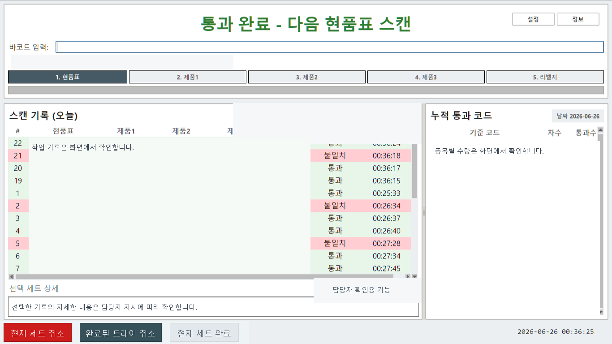

간혹 바코드에 특수문자처럼 보이는 글자가 들어오거나, 스캐너가 이상한 문자열을 입력할 수 있습니다.

작업자 기준 대응:

1. 화면에 이상한 문자가 보이면 계속 진행하지 않습니다.
2. 해당 라벨이나 제품을 작업 리더에게 보여줍니다.
3. 프로그램 폴더나 작업 기록 파일을 직접 열어 고치지 않습니다.
4. 화면 캡처를 남깁니다.

이 화면은 문제가 되는 입력을 확인하기 위한 화면입니다. 작업자는 화면을 캡처한 뒤 담당자에게 알려야 합니다.

## 15. 작업 기록 보기

왼쪽 `스캔 기록 (오늘)`은 오늘 작업한 기록을 보여줍니다.

기록에서 볼 수 있는 것:

- 현품표
- 제품 1
- 제품 2
- 제품 3
- 라벨지
- 결과
- 시간

기록 색상:

- 정상 통과 기록은 일반 배경으로 보입니다.
- 오류나 취소 관련 기록은 눈에 띄는 색으로 표시될 수 있습니다.

기록 선택:

1. 왼쪽 목록에서 한 줄을 클릭합니다.
2. 아래 상세 영역에 선택한 기록의 내용이 표시됩니다.
3. 대상 현품표와 결과가 맞는지 확인합니다.
4. 자세한 값 확인은 담당자 지시에 따릅니다.

주의:

- 기록 화면은 확인용입니다.
- 여기서 작업 기록을 직접 고치지 않습니다.
- 기록 값을 다른 작업에 재사용하지 않습니다.

## 16. 과거 날짜 기록 조회

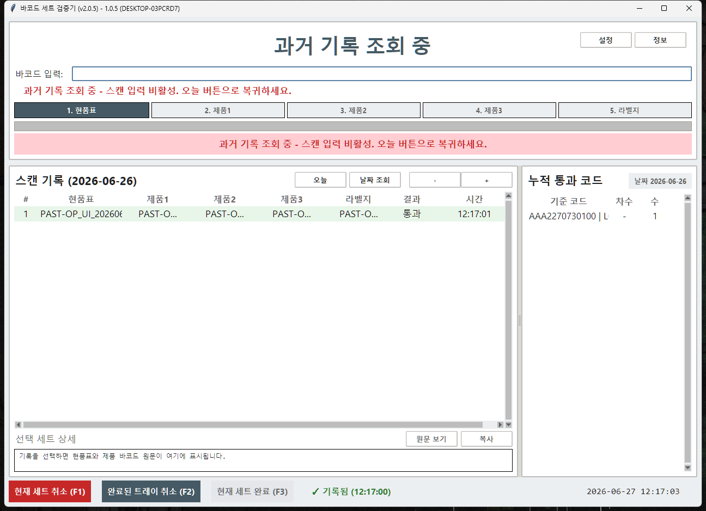

`날짜 조회` 버튼을 누르면 과거 날짜의 작업 기록을 볼 수 있습니다.

사용하는 상황:

- 어제 작업 기록을 확인해야 합니다.
- 특정 날짜에 어떤 현품표가 완료됐는지 찾아야 합니다.
- 취소나 오류가 있었는지 확인해야 합니다.

과거 기록 조회 방법:

1. 왼쪽 기록 영역 위쪽의 `날짜 조회` 버튼을 누릅니다.
2. 확인할 날짜를 선택합니다.
3. 날짜 선택 창에서 확인할 날짜를 고릅니다.

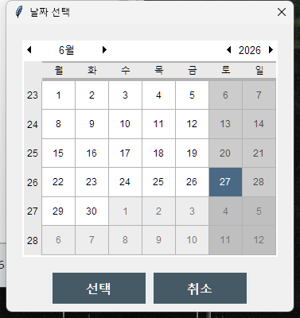

4. 화면 상단이 과거 기록 조회 중으로 바뀌는지 확인합니다.
5. 왼쪽 기록 목록에서 필요한 기록을 확인합니다.

## 17. 과거 기록 조회 중에는 스캔하지 않기

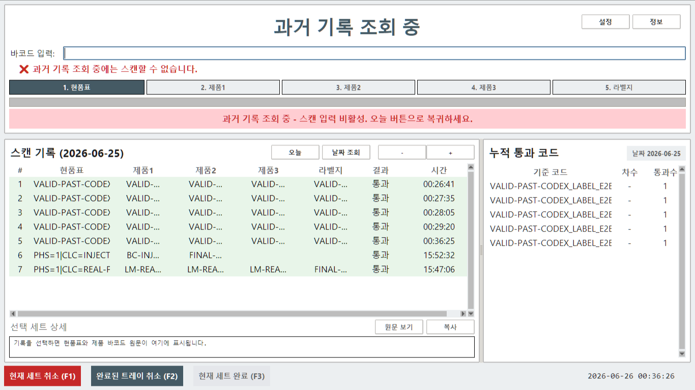

과거 기록 조회 중에는 새 작업을 할 수 없습니다.

과거 조회 중 제한되는 작업:

- 바코드 스캔
- 현재 세트 취소
- 완료된 트레이 취소
- 현재 세트 완료
- 기록 변경

이유:

- 과거 기록을 보는 중에 새 작업이 섞이면 작업자가 오늘 기록과 과거 기록을 혼동할 수 있습니다.
- 프로그램은 실수를 막기 위해 과거 조회 중 스캔 입력을 차단합니다.

## 18. 오늘 작업 화면으로 돌아오기

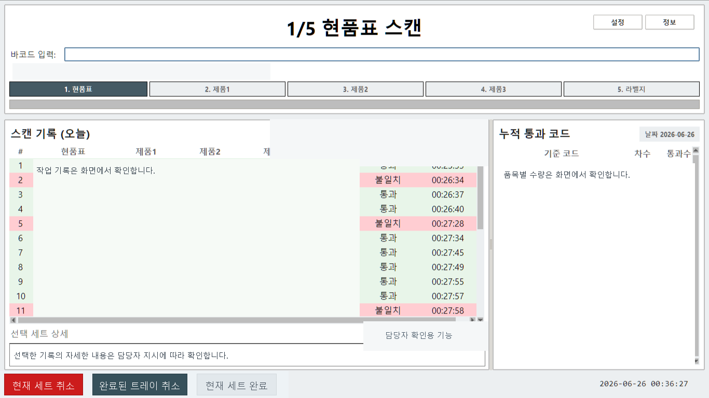

과거 기록을 다 봤으면 반드시 `오늘` 버튼을 눌러 오늘 작업 화면으로 돌아옵니다.

확인할 것:

- 화면이 `1/5 현품표 스캔` 상태인지 확인합니다.
- `스캔 기록 (오늘)`로 돌아왔는지 확인합니다.
- 새 작업을 시작하기 전에 작업자 이름이 맞는지 확인합니다.

## 19. 모든 주요 버튼 설명

### 우측 상단 버튼

`설정`

- 작업자 이름을 확인하거나 변경합니다.
- 작업 중에는 변경하지 않습니다.
- 이름을 바꾸면 다음 작업부터 적용됩니다.

`정보`

- 프로그램 이름과 버전을 확인합니다.
- 담당자가 버전 확인을 요청했을 때만 열어 봅니다.

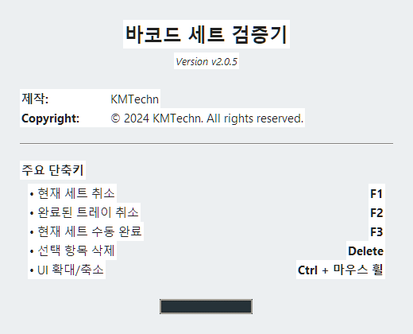

### 기록 영역 버튼

`오늘`

- 과거 기록 조회에서 오늘 작업 화면으로 돌아옵니다.
- 새 작업을 다시 시작하려면 이 버튼으로 오늘 화면에 돌아와야 합니다.

`날짜 조회`

- 과거 날짜의 작업 기록을 조회합니다.
- 조회 중에는 새 스캔을 할 수 없습니다.

기록 영역의 보조 버튼은 담당자 지시가 있을 때만 사용합니다. 일반 작업자는 `오늘`, `날짜 조회`, 왼쪽 기록 선택만 사용하면 됩니다.

### 하단 작업 버튼

`현재 세트 취소`

- 아직 완료되지 않은 현재 작업을 버립니다.
- 새 현품표부터 다시 시작할 때 사용합니다.

`완료된 트레이 취소`

- 이미 통과 완료한 기록을 현품표 기준으로 찾아 취소합니다.
- 작업 리더 지시가 있을 때 사용합니다.

`현재 세트 완료`

- 소량 작업처럼 일부 스캔 후 완료해야 할 때 사용합니다.
- 일반 작업에서는 라벨지까지 5번 스캔해서 자동 완료합니다.

### 키보드 사용 주의

일반 작업은 화면 버튼과 스캐너로 진행합니다. 작업자가 잘 모르는 키는 누르지 않습니다.

키를 잘못 눌렀거나 화면에 확인창이 나오면:

1. 바로 작업을 멈춥니다.
2. 확인창 내용을 혼자 판단하지 않습니다.
3. 작업 리더나 담당자에게 화면을 보여줍니다.

## 20. 작업 중 프로그램을 닫았을 때

스캔 중 프로그램이 꺼지거나 PC가 재시작될 수 있습니다.

이 프로그램은 스캔이 성공할 때마다 현재 세트 상태를 저장합니다. 그래서 같은 날 다시 실행하면 완료되지 않은 작업을 이어서 진행할 수 있는지 물어볼 수 있습니다.

복구 창이 나오면:

1. 현재 작업자가 같은 작업자인지 확인합니다.
2. 이어서 진행할 작업이 맞는지 확인합니다.
3. 맞으면 이어서 진행합니다.
4. 모르겠으면 작업 리더에게 확인합니다.

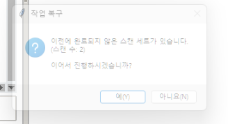

복구를 선택하면 이전에 스캔하던 단계부터 이어서 표시됩니다.

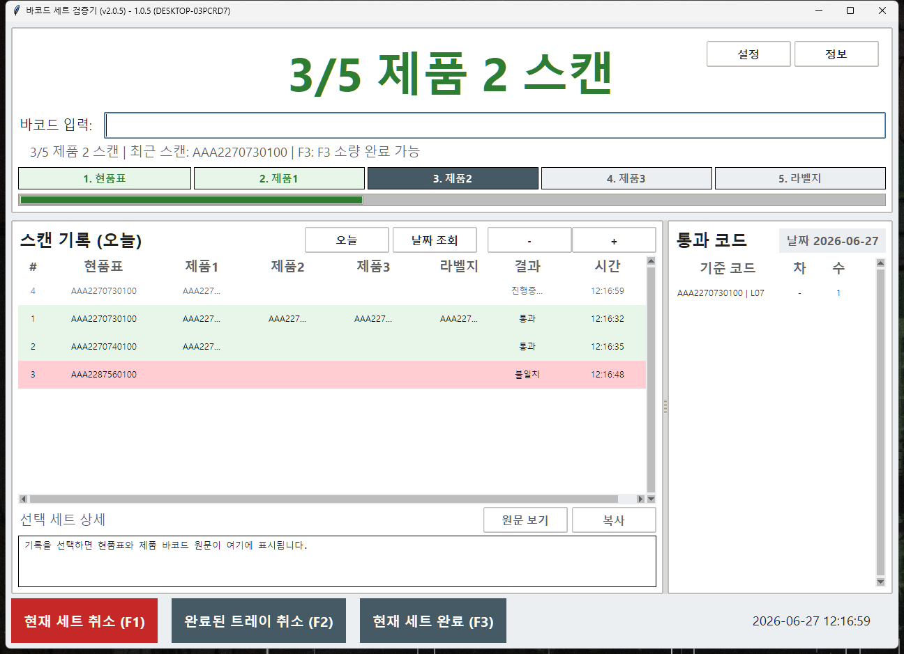

주의:

- 전날 완료되지 않은 작업은 자동으로 삭제될 수 있습니다.
- 다른 작업자의 미완료 작업을 이어서 처리하면 기록이 헷갈릴 수 있습니다.
- 복구 여부가 애매하면 직접 판단하지 말고 담당자에게 확인합니다.

## 21. 인터넷이 끊겨도 작업은 계속할 수 있음

포장실 프로그램은 스캔 결과를 먼저 이 PC 안에 저장합니다.

중요한 점:

- 인터넷이 끊겨도 프로그램 작업은 계속할 수 있습니다.
- 인터넷이 다시 연결된 뒤의 수량 확인은 담당자가 확인합니다.
- 그 전까지는 다른 화면의 수량이 최신이 아닐 수 있습니다.
- PC를 끄면 기록 확인이 늦어질 수 있습니다. 작업 종료 전에는 담당자 지시에 따릅니다.
- 저장공간 부족처럼 보이는 메시지가 있으면 담당자 확인이 필요합니다.
- 사용자는 작업 파일이나 프로그램 관련 파일을 직접 열어 수정하면 안 됩니다.

## 22. 문제가 있을 때 담당자에게 전달하는 방법

일반 작업자가 프로그램 상태를 직접 고칠 필요는 없습니다. 문제가 있으면 화면을 캡처해서 지정 담당자에게 전달합니다.

전달할 수 있는 정보:

1. 프로그램 화면 캡처
2. 오류 팝업 캡처
3. 발생 날짜와 시간
4. 작업자 이름
5. PC 이름
6. 인터넷이 끊겼는지 여부
7. 담당자가 요청한 최소한의 현품표 또는 제품 바코드 정보
8. 어떤 버튼을 눌렀는지

전달 방법:

- 회사에서 승인한 전달 방법만 사용합니다.
- 개인 메신저, 개인 이메일, 외부 클라우드에는 올리지 않습니다.
- 담당자가 요청한 내용만 전달합니다.
- 폴더 전체를 압축해서 보내지 않습니다.

직접 보내면 안 되는 것:

- 알 수 없는 내부 인증값이나 담당자가 요청하지 않은 값
- 작업 기록 원본 파일 전체
- 담당자가 명확히 요청하지 않은 프로그램 관련 파일
- PC 전체 화면이 아니라 다른 회사 자료까지 보이는 캡처

## 23. 담당자에게 말하면 좋은 상태

담당자에게 연락할 때는 어려운 상태값을 읽으려고 하지 말고, 아래처럼 말하면 됩니다.

- "인터넷이 몇 시부터 몇 시까지 끊겼습니다."
- "프로그램은 계속 작업됐지만 다른 화면의 수량이 아직 안 맞습니다."
- "오류 팝업이 반복됩니다."
- "완료 기록이 보이지 않습니다."
- "PC 저장공간 부족처럼 보이는 메시지가 나왔습니다."
- "담당자 확인 필요라고 보입니다."

작업자가 직접 할 일:

- 프로그램 작업은 계속합니다.
- 파일은 수정하지 않습니다.
- 같은 오류가 계속되면 화면을 캡처하고 담당자에게 알립니다.

## 24. 좋은 작업 습관

작업 시작 전:

- 작업자 이름을 확인합니다.
- 스캐너 입력이 되는지 확인합니다.
- 화면이 `1/5 현품표 스캔`인지 확인합니다.

작업 중:

- 항상 화면 맨 위 안내를 봅니다.
- 현품표부터 시작합니다.
- 제품은 순서대로 스캔합니다.
- 오류가 나오면 즉시 멈춥니다.
- 빨간 경고 화면을 그냥 넘기지 않습니다.

작업 후:

- `통과 완료 - 다음 현품표 스캔`이 보였는지 확인합니다.
- 완료 기록이 왼쪽 목록에 들어갔는지 확인합니다.
- 누적 수량이 맞는지 대략 확인합니다.

하지 말아야 할 것:

- 작업 기록 파일을 직접 수정하지 않습니다.
- 오류 기록을 몰래 지우지 않습니다.
- 다른 사람 작업자명으로 작업하지 않습니다.
- 과거 조회 화면에서 새 작업을 시작하려고 하지 않습니다.
- 프로그램 관련 폴더를 삭제하지 않습니다.

## 25. 담당자에게 바로 알려야 하는 상황

아래 상황은 작업자가 혼자 해결하려 하지 말고 담당자에게 알려야 합니다.

- 프로그램이 실행되지 않습니다.
- 스캐너가 메모장에도 입력되지 않습니다.
- 같은 현품표 오류가 반복됩니다.
- 제품이 맞는 것 같은데 계속 불일치가 납니다.
- 완료된 기록이 보이지 않습니다.
- 수량이 눈에 띄게 맞지 않습니다.
- 과거 기록 조회가 되지 않습니다.
- 기록 전달 문제 또는 담당자 확인 필요 상태가 보입니다.
- PC 저장공간 부족 메시지가 보입니다.
- 프로그램을 종료하려는데 기록 보류 메시지가 나옵니다.

전달할 때 포함할 것:

- 화면 캡처
- 발생 시간
- 작업자 이름
- 담당자가 요청한 최소한의 현품표 번호
- 담당자가 요청한 최소한의 제품 바코드
- 어떤 버튼을 눌렀는지
- 인터넷 연결 상태
