# 포장실 프로그램 사용 설명서

대상 프로그램: `Label_Match`

대상 사용자: 포장실 현장 작업자, 작업 리더, 신규 작업자 교육용

작성 기준일: 2026-06-30
문서 개정일: 2026-06-30
파일 최초 작성일: 2026-06-26

이 문서는 포장실 작업자가 실제 화면을 보면서 그대로 따라 할 수 있도록 만든 OUTLINE 게시용 설명서입니다. 화면 기준은 2026-06-30 DISPLAY2 전체화면 검증 캡처입니다.

최신 운영 기준:

- 일반 포장 1세트는 `현품표 1회 + 제품 4개 + 라벨지 1회 = 총 6스캔`입니다.
- 제품은 4개까지만 스캔합니다. `제품5`, `제품6`, `1/8~8/8` 기준은 더 이상 사용하지 않습니다.
- 마지막 라벨지까지 정상 스캔되면 진행률이 `6/6 통과 완료`로 채워진 뒤 다음 현품표 대기 상태로 전환됩니다.
- 스캔 성공음과 오류음은 실제 UI 검증에서 누락 없이 호출되는 것을 확인했습니다.
- Syncthing은 사용하지 않습니다. 작업 기록은 로컬 저장 후 직접 전송 경로에서 취합합니다.

검증 증거:

- UI 캡처: `C:\company\program\_e2e_artifacts\label_match_display2_20260630_004846`
- OUTLINE 이미지 자산: `docs/assets/label_match_user_manual_20260630`
- 보고서: `label_match_operator_ui_walkthrough_report.json`
- 결과: `status=PASS`, `product_sample_count=4`, `total_scan_count=6`, 누락 효과음 없음

## 처음 1건 처리 빠른 시작

1. 프로그램을 실행하고 작업자 이름을 확인합니다.
2. 화면 상단이 `1/6 현품표 스캔`인지 봅니다.
3. 현품표를 스캔합니다.
4. 제품 1부터 제품 4까지 순서대로 스캔합니다.
5. 마지막 라벨지를 스캔합니다.
6. `6/6 통과 완료` 또는 `통과 완료 - 다음 현품표 스캔`이 보이면 다음 현품표를 준비합니다.

## 용어 정리

| 용어 | 뜻 |
|---|---|
| 현품표 | 새 포장 세트를 시작할 때 가장 먼저 스캔하는 기준 바코드 |
| 제품 1~제품 4 | 제품 번호가 아니라 이번 세트에서 첫 번째부터 네 번째로 스캔하는 순서 |
| 라벨지 | 제품 4개 뒤 마지막으로 스캔하는 포장 라벨 바코드 |
| 세트/트레이 | 현품표, 제품 4개, 라벨지를 함께 검증하는 한 작업 단위 |
| 현재 세트 취소 | 완료 전 진행 중인 세트를 중단하고 현품표부터 다시 시작하는 기능 |
| 완료된 트레이 취소 | 이미 통과된 완료 기록을 작업 리더 지시로 취소하는 기능 |
| 복구 | 프로그램 종료 전 저장된 미완료 세트를 다시 불러오는 기능 |

## 전체 워크플로우

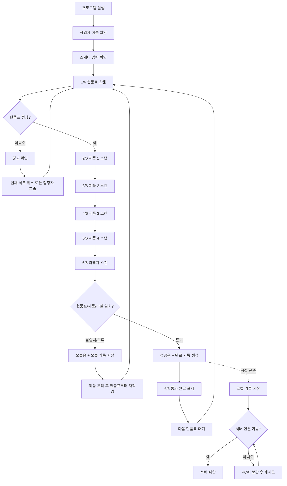

## 1. 꼭 기억할 것

포장실 프로그램은 현품표, 제품 바코드, 라벨지가 서로 맞는지 확인하고 작업 기록을 남기는 프로그램입니다.

작업자가 직접 고치면 안 되는 것:

- 작업 기록 CSV 또는 DB 파일
- 프로그램 설정 파일
- 직접 전송 큐/상태 파일
- 담당자가 요청하지 않은 설치 폴더 파일

문제가 생기면 같은 제품을 반복해서 찍지 말고 화면을 멈춘 뒤 담당자에게 보여줍니다.

## 2. 주요 화면 한눈에 보기

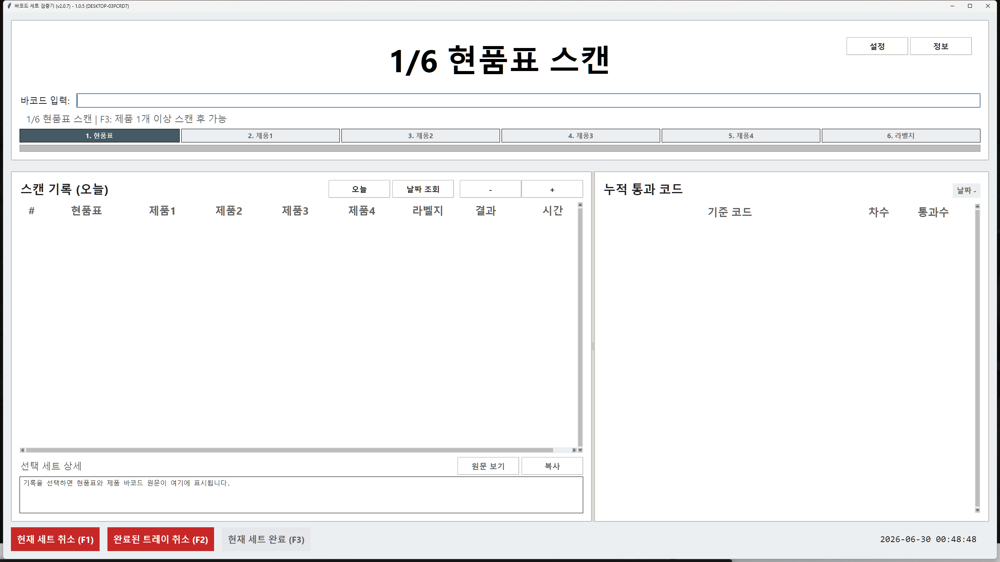

작업자가 주로 보는 곳:

- 화면 상단 큰 안내: 지금 스캔할 단계입니다.
- 바코드 입력칸: 스캐너 입력이 들어가는 곳입니다.
- 단계 표시줄: `현품표, 제품1, 제품2, 제품3, 제품4, 라벨지` 진행 상태입니다.
- 왼쪽 기록: 오늘 처리한 완료/오류 기록입니다.
- 오른쪽 요약: 통과 수량과 오류 상태입니다.

## 3. 정상 6스캔 흐름

### 1/6 현품표 스캔

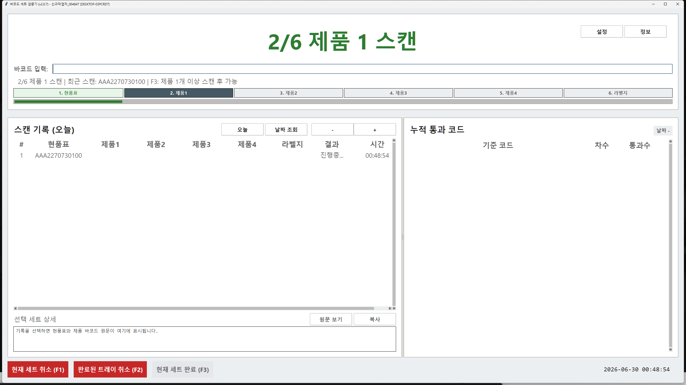

현품표를 먼저 스캔합니다. 현품표가 정상으로 들어가면 다음 단계가 제품 1로 바뀝니다.

### 2/6~5/6 제품 1~4 스캔

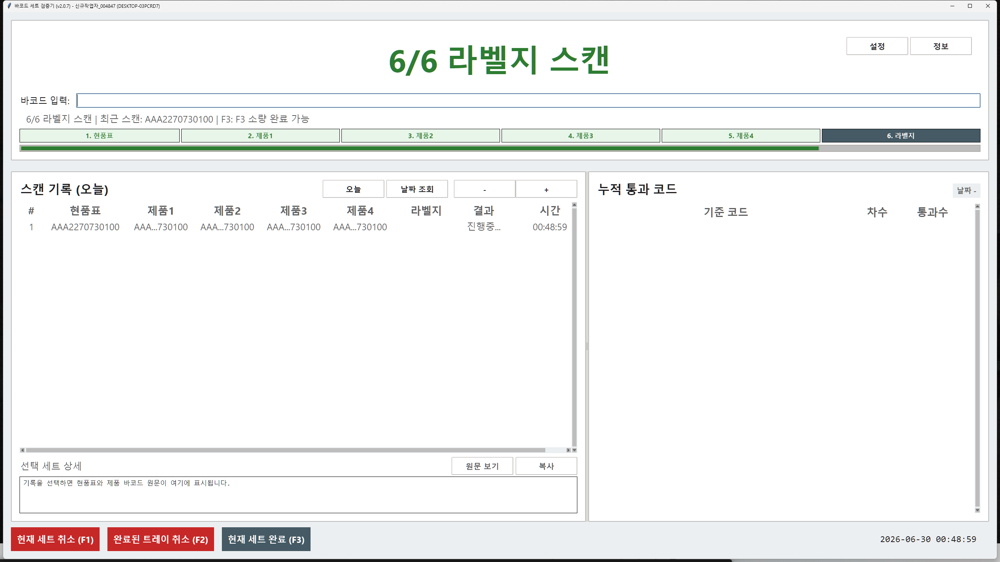

제품은 4개까지만 스캔합니다. 화면의 제품 단계가 바뀌는지 확인하면서 한 개씩 진행합니다.

### 6/6 라벨지 스캔과 완료

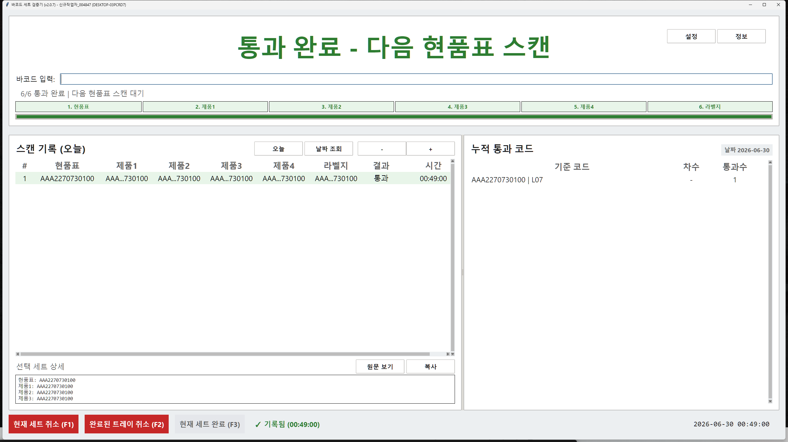

마지막 라벨지를 스캔하면 프로그램이 현품표, 제품 4개, 라벨지를 한 세트로 비교합니다. 정상이라면 성공음이 나고 완료 기록이 저장됩니다.

## 4. 완료 후 화면

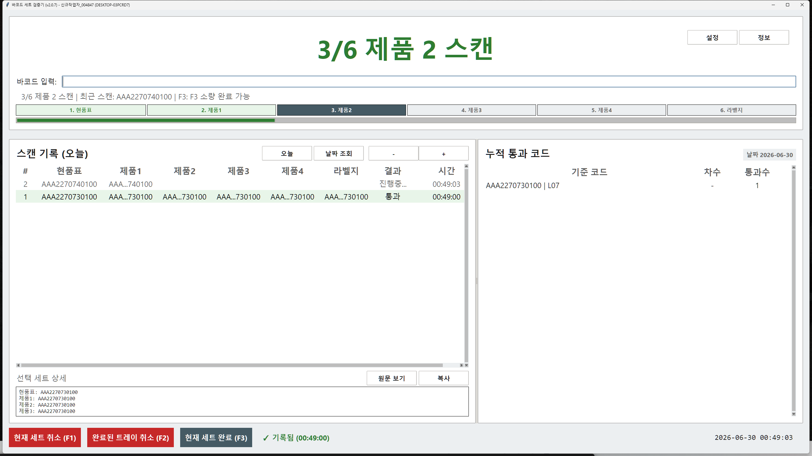

일반 작업에서는 라벨지까지 6번 스캔하면 자동 완료됩니다. 소량/예외 작업은 작업 리더 지시가 있을 때만 `현재 세트 완료`를 사용합니다.

## 5. 오류와 불일치

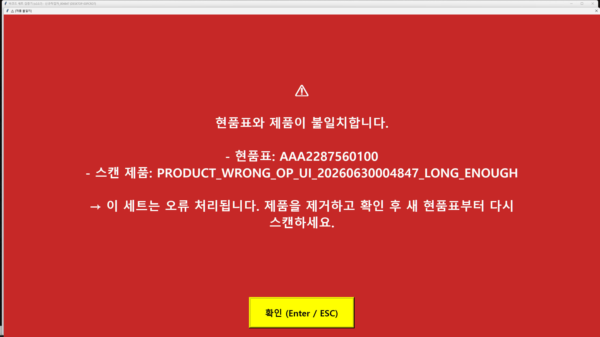

불일치가 나오면 오류음이 울리고 화면이 막힙니다.

처리 순서:

1. 화면 메시지를 확인합니다.
2. 제품과 라벨지를 섞지 말고 분리합니다.
3. 담당자에게 화면과 실물을 보여줍니다.
4. 담당자 지시 후 현품표부터 다시 시작합니다.

## 6. 현재 세트 취소

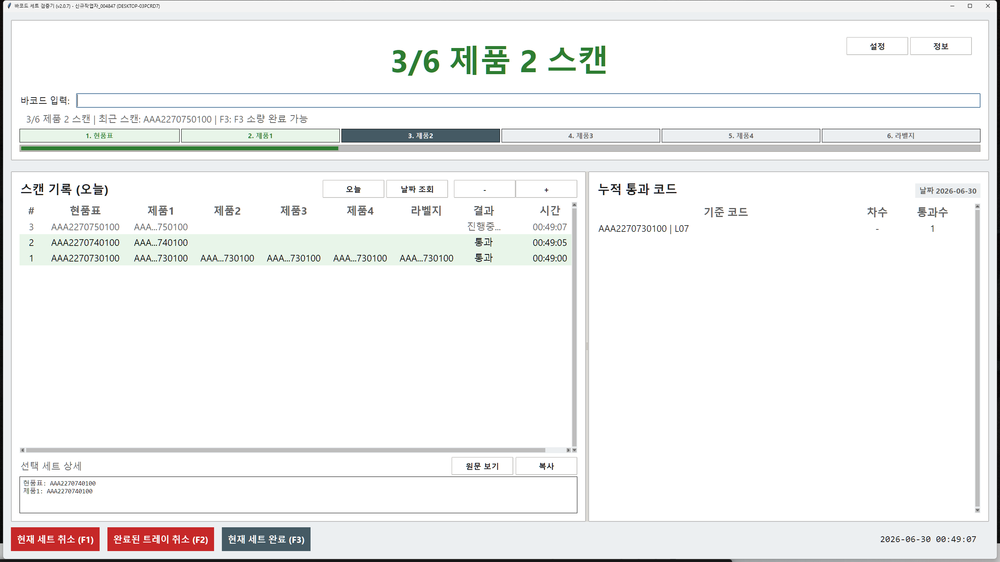

진행 중인 세트를 버리고 새로 시작해야 할 때 사용합니다. 완료된 기록을 되돌리는 기능이 아닙니다.

## 7. 완료된 트레이 취소

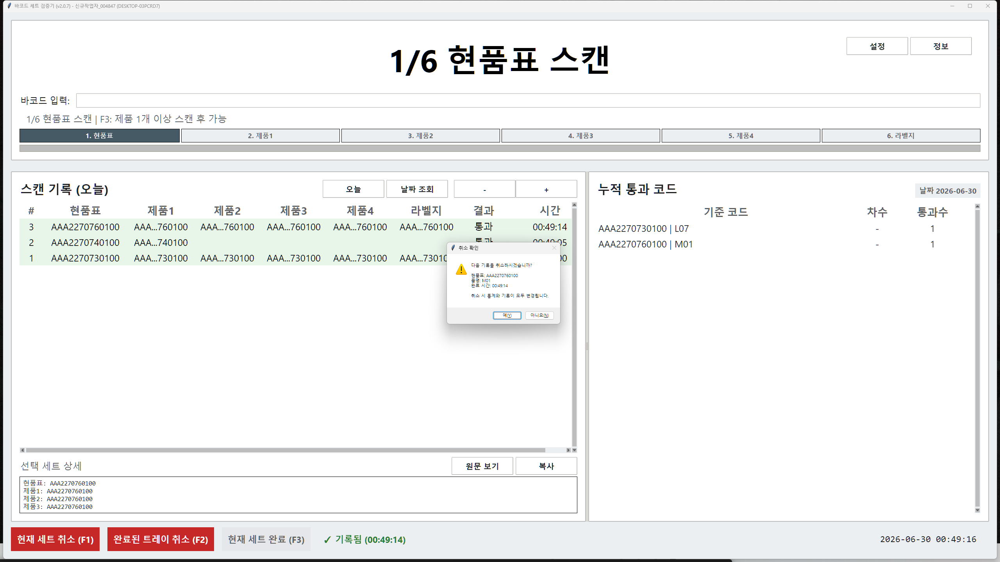

이미 완료된 기록은 작업 리더 지시가 있을 때만 취소합니다. 취소 기록도 별도로 저장되므로, 작업자가 파일을 직접 지우면 안 됩니다.

## 8. 종료 후 복구

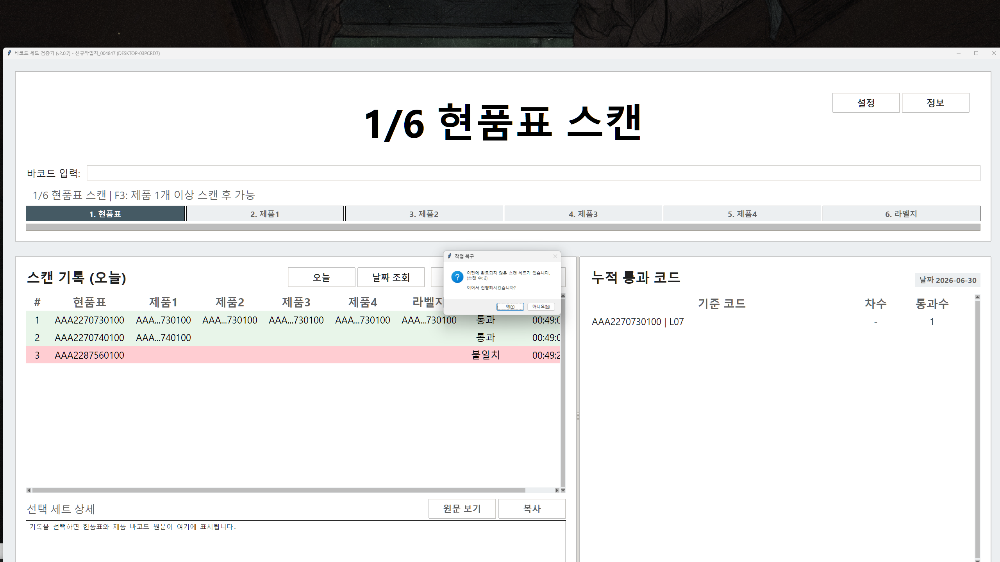

진행 중인 세트가 저장된 상태에서 프로그램을 다시 열면 복구 확인이 나올 수 있습니다. 같은 작업을 이어갈 것이 맞으면 복구하고, 확실하지 않으면 담당자에게 확인합니다.

## 9. 과거 기록 조회

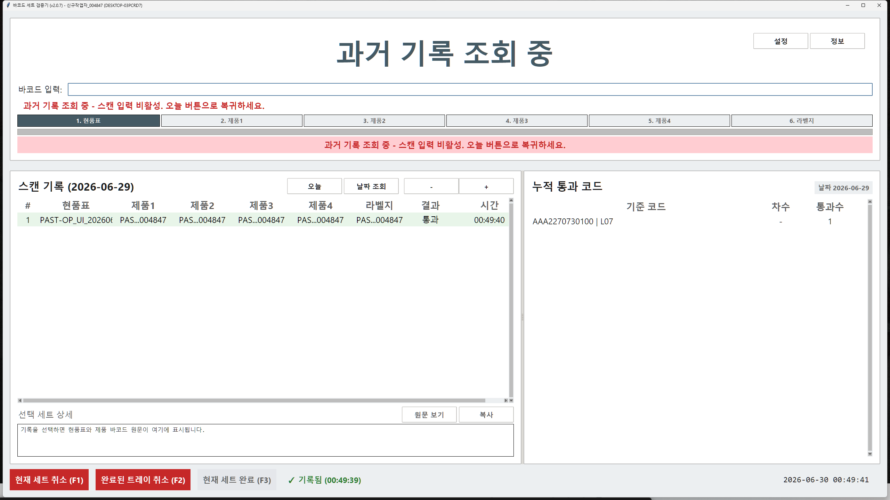

과거 기록 화면은 확인용입니다. 과거 날짜 화면에서는 새 스캔 작업을 하지 말고, 작업 전에는 오늘 화면으로 돌아옵니다.

## 10. 빠른 체크리스트

- 화면이 `1/6 현품표 스캔`이면 새 세트 시작 상태입니다.
- 제품은 4개까지만 스캔합니다.
- 제품 4 다음은 라벨지입니다.
- 완료 후 progress bar가 한 칸 덜 찬 상태로 남으면 안 됩니다. 최신 기준은 `6/6` 모두 채워진 완료 표시입니다.
- 오류음이나 빨간 경고가 나오면 다음 제품을 계속 찍지 않습니다.
- 공유/전송 폴더를 작업자가 직접 만지지 않습니다.
