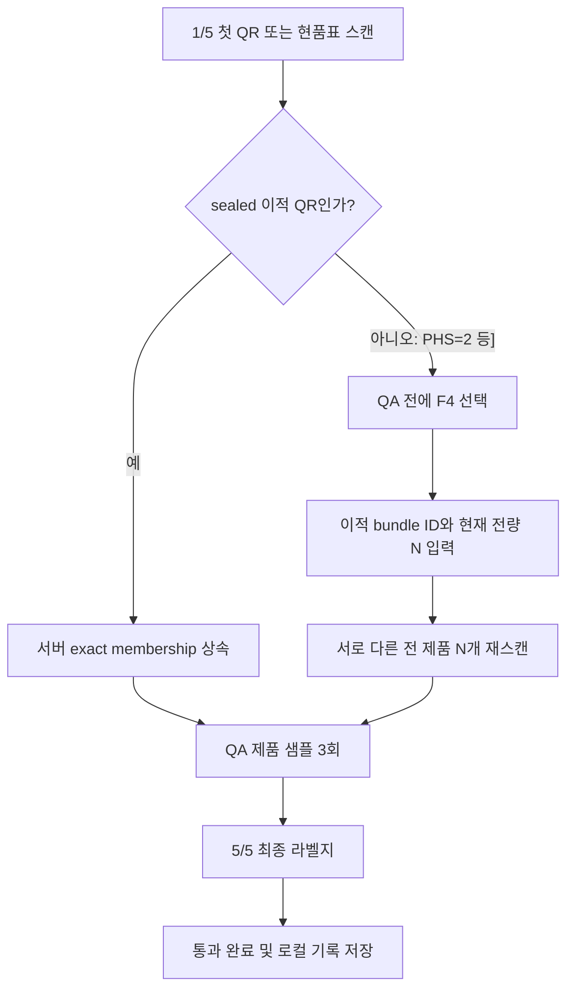

# 포장실 프로그램 사용 설명서

대상 프로그램: `Label_Match v2.0.36`

> **통합 후 게시 차단 상태(2026-07-20):** 이 원고가 참조하는
> `docs/assets/label_match_user_manual_20260716_display2_v2_0_36` 캡처 패킷은
> 현재 저장소에 없습니다. 화면을 임의로 대체하지 않았으며, 최종 `main`의
> 정확한 commit/tree에서 새 DISPLAY2 패킷을 생성·검증하기 전까지 이 문서는
> 텍스트 초안일 뿐입니다. OUTLINE 게시나 릴리스 증빙으로 사용하면 안 됩니다.

대상 사용자: 포장실 현장 작업자, 작업 리더, 신규 작업자 교육 담당자

작성 기준일·문서 개정일: 2026-07-16

파일 최초 작성일: 2026-06-26

이 문서는 현재 프로그램 화면과 포장 계약을 기준으로 한 작업자용 설명서입니다. 화면은 비주 모니터 `\\.\DISPLAY2`의 2560×1440 영역에서 격리된 시연 데이터로 촬영한 자료만 사용합니다.

## 가장 중요한 현재 기준

- 화면의 정상 진행은 `현품표/이적 QR 1회 + QA 제품 샘플 3회 + 최종 라벨지 1회 = 5단계`입니다.
- 세 번의 QA 제품 샘플은 품목 일치 여부를 확인하는 표본이며, 컨테이너 전체 멤버십 목록이 아닙니다.
- `sealed 이적 QR`은 서버의 전체 멤버십을 상속하므로 물리 스캔도 총 5회입니다.
- `PHS=2` 현품표처럼 sealed 증거가 없는 중앙 포장은 QA 전에 `F4 전체 재스캔`으로 현재 제품 전량 `N개`를 별도로 스캔합니다. 이때 물리 스캔 수는 `N + 5회`입니다.
- F4의 목표 수량 `N`은 이적 화면의 현재 전량을 작업자가 확인해 직접 입력합니다. 발행 수량과 자동 연결되지 않습니다.
- 예를 들어 `N=3`인 교육용 세트만 총 8회입니다. `N`이 달라지면 총 스캔 수도 달라집니다.
- Syncthing이나 `C:\Sync`는 사용하지 않습니다. 작업 기록은 먼저 로컬에 저장되고 승인된 직접 전송 경로로 취합됩니다.

## 1. 시작 전 확인

1. 프로그램 제목에서 버전이 `v2.0.36`인지 확인합니다.
2. 설정에서 작업자 이름을 확인합니다.
3. 상단 큰 안내가 `1/5 현품표 스캔`인지 확인합니다.
4. 과거 기록을 보고 있었다면 `오늘` 버튼으로 오늘 작업 화면에 돌아옵니다.
5. 실제 작업에서는 이적 화면의 컨테이너 상태와 수량을 먼저 확인합니다.

화면에서 자주 보는 곳:

- 왼쪽: 현재 품목, 작업자·작업 정보, sealed/F4 멤버십 정보
- 중앙 위쪽: 현재 단계와 다음 스캔, 현품표·제품1·제품2·제품3·라벨지의 5단계 진행, 한 번만 표시되는 안내·경고, 바코드 입력칸
- **중앙 아래쪽 실제 스캔 목록**: 일반 QA 경로에서는 다섯 단계의 기대 항목과 실제 관측값을 행별로 표시하고, F4에서는 현재 전량의 exact 재스캔 목록과 `x/N`을 표시
- 오른쪽 탭: `이번 세션`, `스캔 기록`, `통과 요약`
- 오른쪽 작업 버튼: 현재 세트 취소(F1), 완료 세트 취소(F2), 예외 수동 완료(F3), 전체 재스캔(F4)

작업 중에는 `현재 세트`, `다음 스캔`, 중앙 아래쪽의 실제 스캔 목록을 먼저 봅니다. 과거 기록과 누적 통과 요약은 필요할 때만 오른쪽 보조 탭에서 확인합니다.

## 2. 작업자 설정

작업 시작 전에 본인 이름이 맞는지 확인합니다. 다른 작업자 이름으로 저장하지 않습니다. 교육 캡처에서는 값을 바꾸거나 저장하지 않았습니다.

## 3. 어떤 경로로 작업할지 결정

| 경로 | 화면 단계 | 추가 전량 스캔 | 실제 물리 스캔 수 |
|---|---:|---:|---:|
| sealed 이적 QR | 5단계 | 없음 | 5회 |
| PHS=2 등 sealed 증거 없음 | 5단계 | F4로 N개 | N+5회 |

경로가 불분명하거나 수량을 확정할 수 없으면 진행하지 말고 작업 리더에게 확인합니다.

## 4. PHS=2 + F4 전체 재스캔 경로

### 4-1. PHS=2 현품표를 먼저 스캔

PHS=2 입력 현품표가 승인되면 화면은 제품 샘플 1을 기다립니다. 그러나 중앙 포장에 sealed 증거가 없다면 제품 샘플을 찍기 전에 반드시 `전체 제품 재스캔(F4)`을 선택합니다. 제품 샘플을 먼저 스캔하면 F4를 시작할 수 없습니다.

### 4-2. 이적 ID와 현재 전량 N 입력

1. 이적 화면의 `TRANSFER bundle ID`를 스캔하거나 입력합니다.
2. 이적 화면과 실물을 대조해 현재 컨테이너의 전 제품 수량 `N`을 확인합니다.
3. `전체 재스캔 수량`에 N을 직접 입력합니다.
4. 발행 당시 수량을 그대로 추정하거나 QA 표본 수 3을 N으로 대신하지 않습니다.

### 4-3. 전 제품 N개를 한 번씩 재스캔

화면의 `전체 제품 재스캔 x/N`을 보며 현재 컨테이너의 모든 제품을 한 번씩 스캔합니다. 현재 현품표 품목이 들어 있지 않거나 이미 재스캔한 바코드는 거부됩니다. 오류가 나면 임의로 수량을 바꾸지 말고 실물과 이적 화면을 다시 대조합니다.

N개가 모두 고유하게 승인되면 `전체 재스캔 완료 - 제품 샘플1 스캔`으로 바뀝니다. 이제 일반 5단계의 QA 제품 샘플 3개를 진행합니다. F4 전량 목록과 뒤의 QA 표본 3개는 서로 다른 역할의 증거입니다.

## 5. QA 제품 샘플 3회

제품 샘플 1을 스캔합니다. 제품 바코드에는 현재 현품표의 품목 코드가 들어 있어야 합니다.

제품 샘플 2를 스캔합니다. 같은 바코드를 반복하면 중복 오류가 발생합니다.

제품 샘플 3을 스캔하면 화면이 `5/5 라벨지 스캔`으로 바뀝니다. 세 샘플을 전량 멤버십으로 해석하지 않습니다.

## 6. 최종 라벨지와 완료

최종 라벨지는 다음 조건을 모두 만족해야 합니다.

- 현재 현품표의 품목 코드를 포함
- 전체 길이 31자 이상
- `6DYYYYMMDD` 형식의 실제 존재하는 생산일자 포함
- 현재 세트와 오늘 완료 기록에서 중복되지 않음

정상이면 `5/5 통과 완료 | 다음 현품표 스캔 대기`가 표시되고 완료 기록이 저장됩니다. 완료 문구와 중앙 아래쪽 실제 스캔 다섯 행을 먼저 확인하고, 필요하면 오른쪽 `이번 세션` 탭의 완료 기록을 확인한 뒤 다음 세트를 시작합니다. 연결이 일시적으로 끊겨도 작업 기록은 로컬에 남으며 전송 상태는 담당자가 확인합니다.

## 7. sealed 이적 QR 경로

sealed 이적 QR에는 이적 bundle, 권한 범위, 품목 코드, 정확 수량(QT), 멤버십 해시와 원장 버전 정보가 들어 있습니다. 정상 QR을 첫 단계에서 스캔하면 서버의 exact membership을 상속하므로 F4를 하지 않습니다.

이후에는 QA 제품 샘플 3개와 최종 라벨지를 스캔해 총 5회로 완료합니다. 최종 처리 시 서버의 sealed 정보와 수량·해시·권한 범위가 다시 맞아야 합니다. QR 오류나 이미 포장된 bundle 경고가 나오면 새 QR로 임의 대체하지 말고 이적 담당자에게 확인합니다.

## 8. 오류 화면과 처리

### 품목 불일치

제품 또는 라벨지에 현재 품목 코드가 없으면 세트가 오류 처리됩니다.

1. 경고 내용을 읽고 확인 버튼을 누릅니다.
2. 제품과 라벨을 섞지 말고 분리합니다.
3. 화면과 실물을 작업 리더에게 보여줍니다.
4. 원인을 확인한 뒤 새 현품표부터 다시 시작합니다.

### 중복 스캔

같은 제품을 같은 세트에서 두 번 찍거나 이미 완료한 제품을 다시 찍으면 중복으로 거부됩니다. 다른 제품인지 실물을 확인하고, 경고를 피하려고 바코드나 기록 파일을 수정하지 않습니다.

## 9. 취소 기능

### F1 현재 세트 취소

`현재 세트 취소(F1)`는 완료 전인 현재 세트만 버리고 1/5 상태로 돌아갑니다. 이미 완료된 기록을 되돌리는 기능이 아닙니다. F4 진행 중인 전량 목록도 현재 세트와 함께 사라지므로 실수로 누르지 않습니다.

### F2 완료된 트레이 취소

`완료된 트레이 취소(F2)`는 작업 리더 지시가 있을 때만 사용합니다.

1. 취소할 완료 트레이의 현품표를 스캔하거나 입력합니다.
2. 프로그램이 찾은 완료 기록과 확인 메시지를 대조합니다.
3. 맞는 기록일 때만 확인합니다.
4. 취소 이력도 기록되므로 CSV·DB 파일을 직접 삭제하지 않습니다.

## 10. 종료 후 같은 날 복구

스캔이 끝나지 않은 세트는 각 성공 스캔 뒤 저장됩니다. 종료 전에 현재 단계와 실물을 기억해 둡니다.

같은 날 다시 실행하면 실제 운영 화면에서 `작업 복구` 여부를 묻습니다. 작업자와 실물이 맞을 때만 이어서 진행합니다. 작업자가 다르면 추가 확인이 표시됩니다. 전날의 미완료 상태는 만료되어 자동 삭제되므로 새 현품표부터 시작합니다.

F4 전량 재스캔 도중 종료된 경우에도 같은 날 복구하면 `x/N`에서 이어집니다. 이미 스캔한 실물과 미스캔 실물을 섞지 않습니다.

## 11. F3 예외 수동 완료

`현재 세트 완료(F3)`는 샘플 출고 같은 승인된 소량 예외용입니다. 다음 조건에서만 버튼이 활성화됩니다.

- 현품표 뒤 제품을 1개 이상 스캔한 미완료 세트
- 오류가 한 번도 나지 않은 세트
- F4 전량 재스캔 중이 아닌 세트

작업 리더의 명시적 지시 없이 사용하지 않습니다. 중앙 이적 포장의 sealed membership 또는 F4 전량 증거를 대신하는 방법으로 사용해서는 안 됩니다.

## 12. 시연용 진행 시나리오

시연에서는 실제 생산 바코드와 운영 데이터 폴더를 사용하지 않습니다. 화면 캡처는 임시 저장 경로에서 전송·업데이트를 모두 끄고 진행했습니다. 전체 체인 시연에서 서버 확인이 필요하면 승인된 시연용 endpoint와 테스트 식별자만 사용합니다.

### 2026-07-16 전체 체인 시연 고정값

- 검사·이적에서 포장으로 넘기는 시연 수량은 `N=60`입니다.
- 현재 이적 컨테이너 프로그램 화면에는 Label_Match가 첫 단계에서 읽을 sealed transfer QR을 표시하거나 인쇄하는 기능이 없습니다.
- 따라서 이번 전체 체인에서는 sealed 경로를 선택하지 않고 `PHS=2 현품표 + F4 전체 재스캔` 경로로 고정합니다.
- 실제 물리 스캔은 `PHS 현품표 1 + F4 전량 60 + QA 제품 샘플 3 + 최종 라벨지 1 = 총 65회`입니다.
- F4 수량 입력창에는 임의의 교육용 숫자가 아니라 이적 readback으로 확인한 `60`을 입력합니다.

단계 전환 전에 서버 응답도 확인합니다. 이적 제출의 `ACK/COMMITTED`와 authoritative readback의 bundle·수량 60·멤버십 해시가 모두 맞아야 포장으로 넘어갑니다. 포장 제출 뒤에는 package receipt `ACKED`와 readback이 맞는지 담당자가 확인합니다.

응답이 끊기거나 `ACK/COMMITTED/readback` 중 하나라도 불명확하면 같은 실물을 다시 스캔하거나 새 이적/포장 명령을 발행하지 않습니다. 실물을 분리해 그대로 두고 bundle ID·동일 idempotency key로 receipt/readback을 조회한 뒤 작업 리더 지시에 따릅니다. 새 키로 재시도하면 이미 반영된 작업을 중복 처리할 수 있습니다.

### 시나리오 A — PHS=2 + F4

1. 시작 화면과 작업자 설정을 설명합니다.
2. PHS=2 현품표를 스캔하고 F4 버튼 활성화를 보여줍니다.
3. 이적 bundle ID와 전체 체인 고정 수량 `N=60`을 입력합니다.
4. 서로 다른 제품 60개를 전량 재스캔해 완료 문구를 보여줍니다.
5. QA 샘플 3개와 최종 라벨지를 스캔해 5/5 완료를 보여줍니다.
6. `UI 5단계`, `전량 N개`, `물리 스캔 N+5회`를 다시 구분해 설명합니다.

### 시나리오 B — 별도 격리 오류·복구 설명

전체 체인과 다른 격리 fixture에서만 실행합니다. 시나리오 A의 fresh PHS, 60개 제품, transfer bundle, 최종 label output을 오류 재현·F1/F2·복구에 사용하거나 취소하지 않습니다.

1. 품목이 다른 제품으로 불일치 화면을 보여줍니다.
2. 같은 제품을 반복해 중복 화면을 보여줍니다.
3. 진행 중 세트에서 F1의 범위를 설명합니다.
4. F2 입력창에서 완료 트레이 취소는 리더 승인 작업임을 설명하고 취소합니다.
5. 미완료 세트를 종료·재실행해 같은 날 단계 복구를 보여줍니다.

### 시나리오 C — sealed 이적 QR 단독 기능 설명

이번 전체 체인에서는 실행하지 않습니다. 사전에 준비한 포장 프로그램 단독 테스트 QR과 캡처로만 다음 계약을 설명합니다.

1. sealed 이적 QR을 첫 단계에 스캔합니다.
2. QT와 멤버십 해시가 상속되어 F4가 비활성인 점을 보여줍니다.
3. QA 샘플 3개와 최종 라벨지까지 총 5회라는 차이를 설명합니다.

## 13. 작업자 최종 체크리스트

- 새 세트는 `1/5 현품표 스캔`에서 시작한다.
- QA 제품 샘플은 정확히 3회이며 전량 멤버십이 아니다.
- sealed 이적 QR이면 총 5회, PHS+F4이면 총 N+5회다.
- F4의 N은 이적 화면과 실물로 확인해 직접 입력한다.
- PHS+F4는 QA 제품 샘플 전에 전량 재스캔을 끝낸다.
- 이번 전체 체인 시연은 N=60, 총 65회이며 sealed 경로를 선택하지 않는다.
- ACK/COMMITTED/readback이 불명확하면 재스캔·재발행하지 않고 담당자에게 확인한다.
- 완료 문구와 중앙 아래쪽 실제 스캔 목록을 확인한 뒤 다음 세트를 시작한다.
- 오류가 나면 계속 스캔하지 말고 실물을 분리한다.
- F2와 F3은 작업 리더 승인 없이 사용하지 않는다.
- 과거 기록 조회 중에는 스캔하지 않고 오늘 화면으로 돌아온다.
- 운영 기록, 설정, 전송 큐 파일을 직접 수정하거나 삭제하지 않는다.

## 14. 관리자용 캡처 검증 자료

- 캡처 폴더: `docs/assets/label_match_user_manual_20260716_display2_v2_0_36`
- 원본: `raw/` 17장
- 작업자용 주석본: `annotated/` 17장
- 전체 확인표: `contact_sheet.png`
- 기하 좌표·해시·픽셀 QA·격리 설정: 매니페스트 계약 v2의 `manifest.json`
- 프로그램 소스: commit `faaca1c7783e2e7a91b0fea862e23eefefde09bd`, tree `3d169822fae1cf978b3623cfbb433e5e647615bb`, 앱 버전 `v2.0.36`
- 캡처 대상: 비주 모니터 `\\.\DISPLAY2`, 화면 rect `(693, -1440)–(3253, 0)`, work rect `(693, -1440)–(3253, -48)`
- 창 계약: 각 캡처에서 앱 root 창이 DISPLAY2 안에 완전히 들어가고, 대상 창이 foreground이며, 대화상자는 앱 root에 속해야 함
- 중앙 목록 계약: 일반 QA 캡처는 기대 단계와 실제 관측값의 다섯 행을, F4 캡처는 exact 전량 행과 `x/N`을 매니페스트에 기록하고 화면과 일치해야 함
- 개인정보 계약: 호스트명, 사용자 프로필 절대경로, 임시 폴더 절대경로, 운영 바코드·토큰·식별자를 이미지와 매니페스트에 남기지 않음
- 게시 허용 조건: 매니페스트 v2 `status=PASS`, `image_contract_ok=true`, 17/17 이미지가 각 2560×1440이고 모든 소스·모니터·foreground·중앙 목록·개인정보 검사가 통과함

원본과 주석본은 별도 보관합니다. 주석은 Tk 위젯 또는 Win32 창의 실제 좌표에서 생성한 빨간 테두리와 라벨이며, 원본 화면 데이터는 수정하지 않습니다. 검증 조건 하나라도 실패한 캡처는 설명서나 OUTLINE 게시에 사용하지 않습니다.
