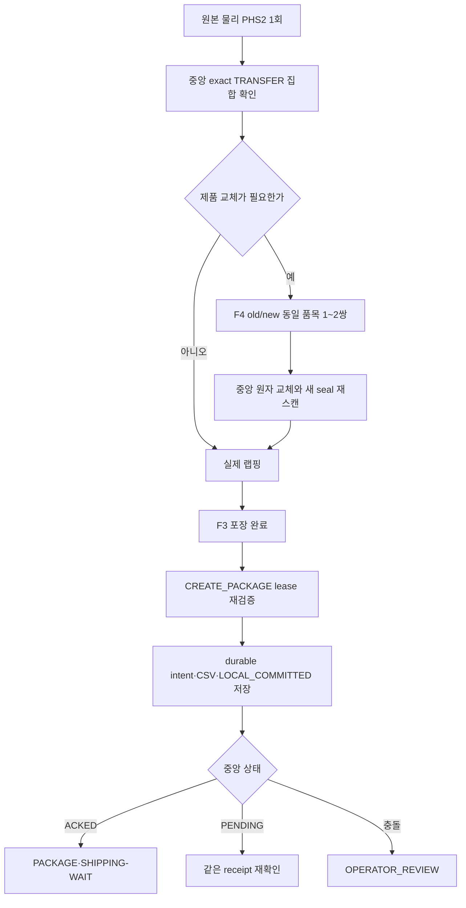
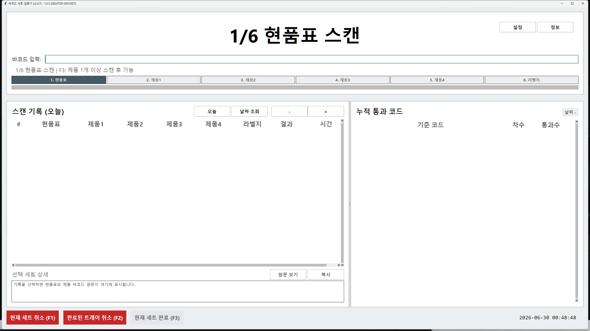
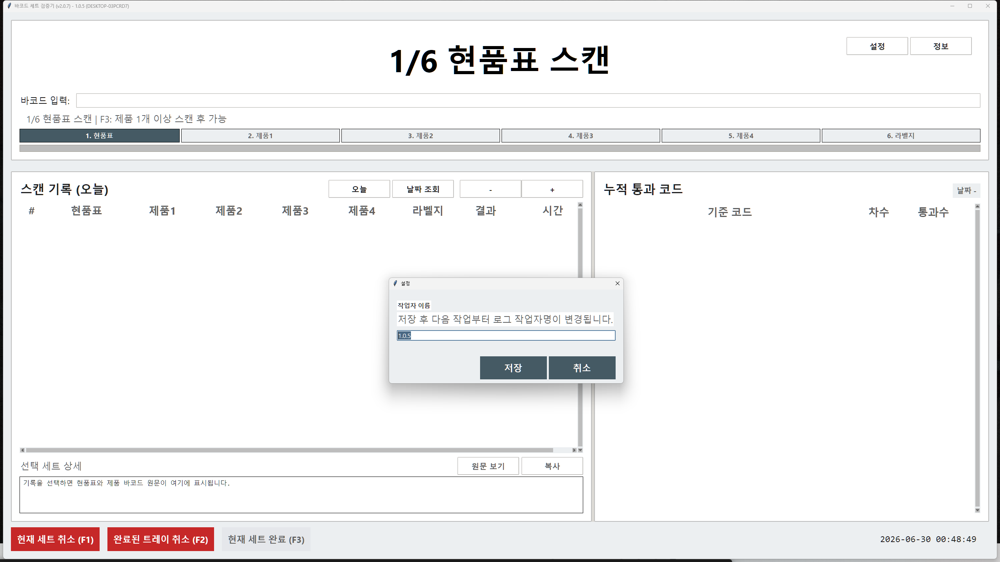
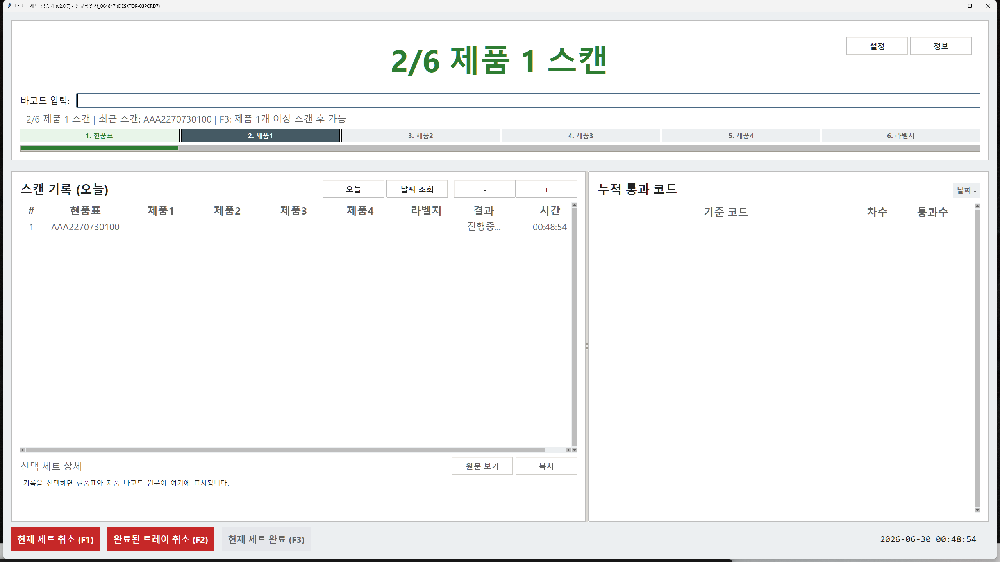
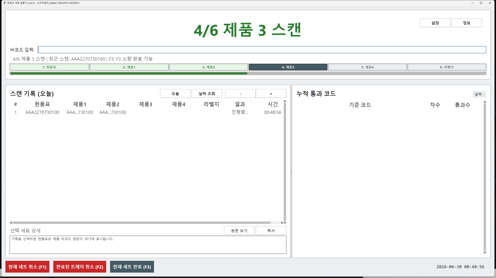
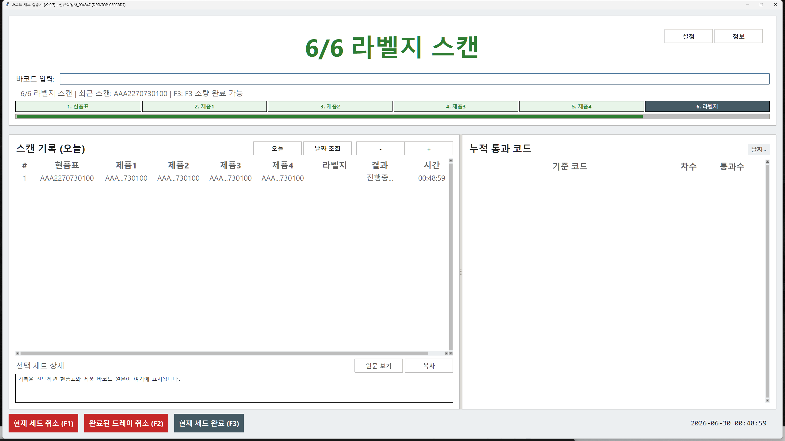
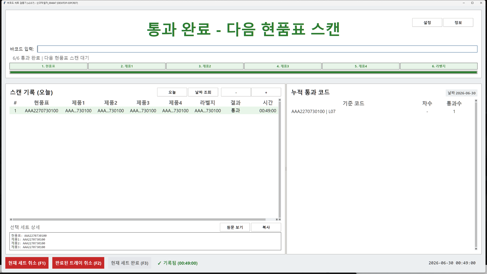
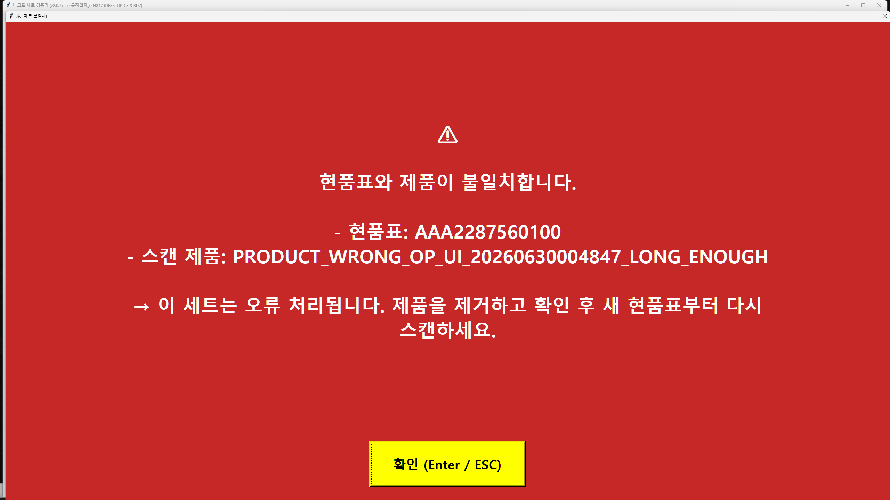
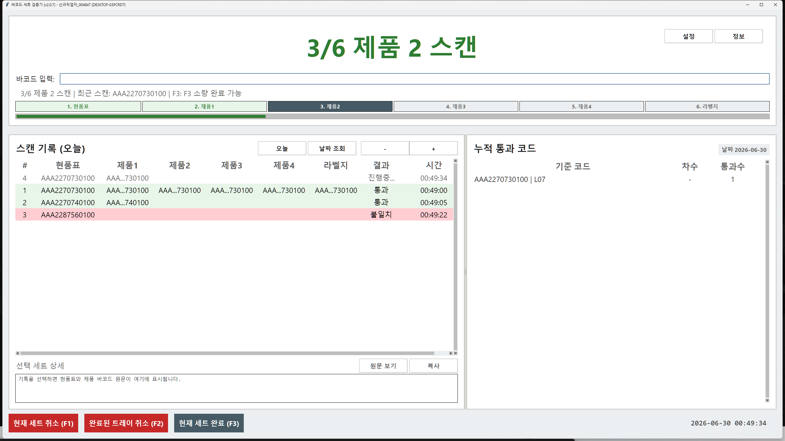

# HISTORICAL — 현장 사용 금지

현장 작업자 정본: [LABEL_MATCH_WORKER_GUIDE.md](LABEL_MATCH_WORKER_GUIDE.md)

이 파일은 과거 OUTLINE 원고와 레거시 캡처 설명을 보존한 이력 자료입니다. 현재
작업·교육·게시 기준으로 사용하지 마세요.

# 포장실 프로그램 사용 설명서 (이력 보존본)

당시 대상 프로그램 표기는 폐기되었습니다. 현재 제품 코드 대조 기준은
`9363f5e0`이며, 승인 배포본 identity/evidence는 정본의 `캡처 대기` 항목으로
관리합니다.

문서 갱신일: `2026-08-03`

대상 사용자: 포장실 작업자와 작업 리더

현재 표준은 **원본 물리 PHS2 1회 → 필요할 때만 F4 동일 품목 1~2쌍 원자 교체 → 실제 랩핑 → F3 포장 완료**입니다. 제품 3개, 최종 라벨 또는 전체 제품 N개를 추가 스캔하는 구형 절차를 현재 작업에 사용하지 마세요.

> **화면 자산 안내:** 저장소의 기존 화면은 구형 다단계 UI를 촬영한 레거시
> 증거입니다. 적용 commit 이후의 PHS2 1회, 선택 F4, F3, busy와 중앙 상태
> 화면은 저장소 밖의 **`M7 external capture bundle v1`로 대체 예정**입니다.
> 기존 tracked 이미지는 삭제하지 않고 이력으로 보존하지만 현장 기준으로 사용하지
> 마세요.

## 1. 한눈에 보는 표준 작업

| 단계 | 작업자가 할 일 | 프로그램이 확인하는 것 |
| --- | --- | --- |
| 시작 | 원본 물리 PHS2를 한 번 스캔하세요. | 현재 ACTIVE 라벨과 중앙 exact TRANSFER membership |
| 선택 교체 | 교체가 필요할 때만 F4를 사용하세요. | 같은 품목 old/new 1~2쌍의 원자 교체와 새 전자 seal |
| 랩핑 | 화면의 제품 집합과 실물을 대조한 뒤 실제로 랩핑하세요. | PHS2에서 상속한 exact 제품 집합 유지 |
| 완료 | 랩핑 뒤 F3를 누르세요. | `CREATE_PACKAGE` lease, durable intent, CSV와 로컬 완료 표식 |
| 중앙 확인 | ACK 또는 대기·충돌 상태를 확인하세요. | PACKAGE와 `SHIPPING-WAIT` 중앙 projection |

```mermaid
flowchart TD
    A[원본 물리 PHS2 1회] --> B[중앙 exact TRANSFER 집합 확인]
    B --> C{제품 교체가 필요한가}
    C -- 예 --> D[F4 old/new 동일 품목 1~2쌍]
    D --> E[중앙 원자 교체와 새 seal 재스캔]
    C -- 아니오 --> F[실제 랩핑]
    E --> F
    F --> G[F3 포장 완료]
    G --> H[CREATE_PACKAGE lease 재검증]
    H --> I[durable intent·CSV·LOCAL_COMMITTED 저장]
    I --> J{중앙 상태}
    J -- ACKED --> K[PACKAGE·SHIPPING-WAIT]
    J -- PENDING --> L[같은 receipt 재확인]
    J -- 충돌 --> M[OPERATOR_REVIEW]
```

## 2. 시작 전 확인

1. 화면 버전이 승인된 운영 기준과 같은지 확인하세요. 승인 배포 버전과 증거는
   정본의 TODO가 해소되기 전까지 `UNPROVEN`입니다.
2. 작업자 이름이 본인인지 확인하세요.
3. 이전 PHS2, F4 교체, 로컬 완료 또는 중앙 outbox 복구 안내가 있으면 그 작업부터 확인하세요.
4. 원본 물리 PHS2와 실물 묶음을 함께 준비하세요.
5. 이적 봉인 QR이나 제품 바코드를 첫 입력으로 사용하지 마세요.

현재 표준 PHS2는 다음 6개 필드만 정해진 순서로 사용합니다.

`PHS=2|SRC=KMTECH_INPUT_TAG|ITG=...|CLC=...|LBL=...|HSH=...`

`QT` 또는 추가 필드를 붙이지 마세요. PHS2 한 번 스캔은 제품 한 개만 포장한다는 뜻이 아니라 중앙의 전체 exact membership을 상속한다는 뜻입니다.

> 레거시 시작 화면은 현재 표준 단계 수와 다릅니다.

## 3. 원본 물리 PHS2 한 번 스캔

1. 원본 PHS2를 한 번 스캔하세요.
2. 품목, 물리 라벨 ID와 work group을 실물과 대조하세요.
3. 중앙에서 source가 `PACKAGE_SOURCE / AVAILABLE`인지 확인하세요.
4. 화면에 상속된 전체 제품 수와 membership 정보를 확인하세요.
5. 화면이 F4 또는 F3 준비 상태로 바뀌는지 확인하세요.

프로그램은 수량과 hash만 보지 않습니다. 전체 제품 ID, 각 제품 ID와 바코드의 1:1 대응, 품목·UOM, source 위치 `TRANSFER`, ACTIVE seal과 entity version을 함께 고정합니다.

PHS2를 전량 제품 재스캔으로 대체하지 마세요. 수량이 같은 다른 제품 집합도 허용되지 않습니다.

## 4. 선택 F4 제품 교체

F4는 제품 교체가 실제로 필요할 때만 사용합니다.

1. F4를 누르기 전에 현재 묶음이 단일 transfer 전체를 대표하는지 확인하세요.
2. 교체할 기존 제품 old를 먼저 스캔하세요.
3. 같은 품목의 새 GOOD 제품 new를 다음에 스캔하세요.
4. 1쌍 또는 2쌍의 대응 관계를 확인하세요.
5. 중앙 원자 교체 ACK를 기다리세요.
6. 화면에 나온 새 전자 seal QR을 정확히 다시 스캔하세요.
7. 새 membership이 로컬 세트에 반영됐는지 확인하세요.

F4는 온라인 전용입니다. 여러 transfer를 합친 work group이나 일부 분할 source에서는 차단될 수 있습니다. 교체 뒤에도 원본 물리 PHS2는 그대로 사용하며 새 PHS2를 출력하지 않습니다.

제품 전량을 F4로 스캔하거나 작업자가 목표 N을 입력하지 마세요. old/new 품목이 다르거나 2쌍을 넘으면 진행하지 마세요.

## 5. 랩핑과 F3 완료

1. 화면의 품목과 exact 제품 집합을 실물과 대조하세요.
2. 제품을 실제로 랩핑하세요.
3. 랩핑이 끝난 뒤 F3를 누르세요.
4. 저장된 유효 lease가 있으면 재검증하고, 없으면 서버에서 `CREATE_PACKAGE` lease를 받아 현재 상태에 저장합니다.
5. 완료 화면에서 로컬 상태와 중앙 상태를 따로 확인하세요.

F3는 현재 표준 포장 완료 버튼입니다. 샘플 출고용 예외 완료로 해석하지 마세요.

프로그램은 다음 순서를 모두 통과한 뒤에만 성공을 표시합니다.

1. 같은 set과 package ID의 deterministic 중앙 intent를 SQLite에 저장합니다.
2. `TRAY_COMPLETE` 이벤트 CSV를 flush·fsync합니다.
3. SQLite에 로컬 완료 표식과 lease `LOCAL_COMPLETED`를 기록합니다.
4. 화면에 `LOCAL_COMMITTED` 완료를 표시하고 다음 PHS2 대기로 이동합니다.
5. 중앙 명령은 같은 idempotency key로 별도 전송합니다.

## 6. 중앙 상태 읽기

| 표시 | 의미 | 행동 |
| --- | --- | --- |
| `LOCAL_COMMITTED` | 실물 포장과 로컬 durable 기록이 저장됐습니다. | 같은 PHS2나 F3를 반복하지 마세요. |
| `PENDING` | 중앙 명령이 같은 key로 재시도 중입니다. | receipt 확인을 기다리세요. |
| `ACKED` | 중앙 PACKAGE와 readback이 확인됐습니다. | `SHIPPING-WAIT` 인계 조건을 확인하세요. |
| `CONFLICT / OPERATOR_REVIEW` | source, member, seal 또는 version이 중앙과 다릅니다. | 실물을 분리하고 작업 리더에게 인계하세요. |

중앙 ACK가 늦어도 로컬 완료를 지우지 않습니다. ACK 유실 시 새 package를 만들지 않고 저장된 명령의 receipt를 먼저 확인합니다.

## 7. lease와 오프라인 경계

- 첫 PHS2 조회는 membership을 읽는 단계이며 자동으로 오프라인 F3 권한을 보장하지 않습니다.
- F3 때 유효한 `CREATE_PACKAGE` lease가 저장돼 있어야 오프라인 로컬 완료가 가능합니다.
- 저장 lease가 없고 서버도 사용할 수 없으면 intent, CSV와 완료 표식을 만들지 않고 현재 세트를 유지합니다.
- lease 발급 뒤 현재 상태 저장이 실패하면 F3를 완료로 보지 마세요.

연결이 끊겼다고 같은 PHS2를 새 세트로 만들지 마세요.

## 8. 오류와 복구

| 상황 | 작업자 조치 |
| --- | --- |
| 원본 PHS2가 아닌 첫 입력 | 올바른 원본 물리 PHS2를 준비해 다시 시작하세요. |
| PHS2 라벨·품목·membership 불일치 | 새 세트를 만들지 말고 Container와 중앙 상태를 확인하세요. |
| F4 교체 ACK 불명확 | old/new 실물을 고정하고 같은 교체 receipt를 확인하세요. |
| F3 lease 없음·오프라인 | 현재 세트를 보존하고 연결 복구 뒤 같은 F3를 재시도하세요. |
| SQLite·CSV·완료 표식 저장 실패 | 랩핑 실물을 이동하지 말고 저장 공간과 권한을 확인하세요. |
| `PENDING` 또는 timeout | 같은 PHS2·F3를 반복하지 말고 자동 재시도를 기다리세요. |
| `OPERATOR_REVIEW` | 로컬 완료 증거를 지우지 말고 실물을 분리하세요. |

재시작하면 intent만 있는지, CSV와 로컬 완료 표식까지 있는지 순서대로 reconciliation합니다. 여러 복구 후보가 있으면 자동으로 고르지 않습니다. DB, CSV, 현재 상태와 outbox를 직접 편집하지 마세요.

## 9. 앞뒤 공정 영향

- 앞 공정의 기준은 Container 로컬 CSV가 아니라 중앙 exact `TRANSFER`와 ACTIVE seal입니다.
- 중앙 `ACKED` 뒤 source transfer는 `CONSUMED`가 되고 같은 exact membership의 `PACKAGE`가 생성됩니다.
- 제품 위치는 `TRANSFER`에서 `SHIPPING-WAIT`로 이동합니다.
- 분석 CSV direct-sync와 운영 package 명령은 별도 통로입니다. 한쪽 성공으로 다른 쪽 완료를 추측하지 마세요.
- 출고는 현재 PACKAGE version과 actual membership을 다시 확인합니다.

## 10. 취소와 관리자 기능

- 현재 세트 취소는 F3 전 작업만 대상으로 하세요.
- 완료 package 취소는 중앙 package와 membership version을 확인한 관리자 절차로 수행하세요.
- F4 교체가 미확정이거나 완료 CSV가 저장되지 않았으면 창을 닫지 마세요.
- 날짜가 바뀌어도 중앙 PHS2와 outbox 증거를 자동 삭제하지 마세요.

## 11. 레거시 다단계 화면 부록

다음 화면은 과거 제품 3회, 최종 라벨, N회 전량 스캔과 다단계 진행 UI의 이력 자료입니다. 현재 표준 작업에 사용하지 마세요.

구형 제품 3회, 최종 라벨과 N회 전량 스캔은 중앙 PHS2 표준의 대안이 아닙니다. 별도 호환 입력을 처리할 때만 승인된 레거시 절차로 격리하세요.

## 12. M7 external capture bundle v1과 보고

이 이력 원고는 별도 화면 계약을 정의하지 않습니다. 현행 정본은
`E:/KMTech/production-readiness-20260830/HANDOVER/CAPTURE-BUNDLE-V1-CONTRACT.md`이고,
schema는 `M7 external capture bundle v1`, 앱 식별자는 `app=Label_Match`, 외부 앱
root는 `E:/requal-evidence/capture-bundle-v1/Label_Match/`입니다. 필수 state ID는
다음과 같습니다.

1. `phs2_admitted_busy`
2. `phs2_rejected_input_preserved`
3. `f4_admitted_busy`
4. `f4_rejected_input_preserved`
5. `f3_admitted_busy`
6. `f3_rejected_input_preserved`
7. `central_submission_wait`
8. `central_submission_conflict`
9. `broken_fail_closed_warning`

조회는 `E:/KMTech/production-readiness-20260830/HANDOVER/HANDOVER-INDEX.md`에서
시작합니다. 그 문서가 게시한 immutable
`E:/requal-evidence/capture-bundle-v1/indexes/handover-index__<YYYYMMDDTHHMMSSZ>__<nonce8>.json`
receipt에서 `app=Label_Match`를 선택하고, 해당
`Label_Match/<bundle-id>/manifest.json`의 `captures[].state_id`로 필요한 화면을
찾습니다. 이 문서에는 raster, bundle-id 또는 나중에 생성된 digest 값을 다시
쓰지 않습니다.

`L-5` BROKEN 경고/입력 재활성 위험과 `L-6` synchronous generation fence가 제품
판정 대기인 동안 release capture gate는 차단됩니다. `broken_fail_closed_warning`이
실제 fail-closed 상태를 보이지 않으면 정상 화면으로 대체하거나 게시하지 마세요.
아래 tracked 레거시 이미지는 삭제하지 않으며 external bundle이 승인될 때까지
대체 예정 상태로 남습니다.

화면 문제를 보고할 때는 프로그램 버전, 작업자, PHS2, source/work group, F4 old/new, package ID, lease와 중앙 상태, 재시도 여부를 함께 전달하세요. 비밀 token이나 DB 전체 파일을 전달하지 마세요.
